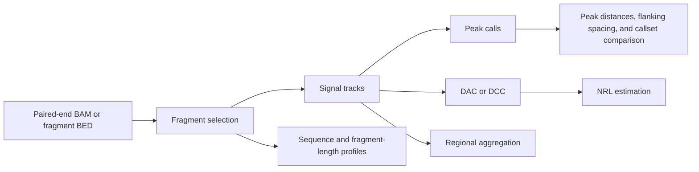

# NucleoSuite

NucleoSuite is a command-line toolkit that converts paired-end alignments or fragment intervals into nucleosome-positioning signals, cfDNA and MNase-seq fragmentomic analyses, peak calls, chromatin-state profiles, sequence profiles, spacing measurements, and coordinated workflows.

```bash
nucleosuite COMMAND [options]
```

Verify an installation with:

```bash
nucleosuite --version
nucleosuite --help
```

## Commands

### Fragment preparation

| Command | Function |
|---|---|
| [`fragments`](docs/commands/fragments.md) | Convert paired-end alignments to BED fragment intervals or combine fragment files. |
| [`merge-bams`](docs/commands/merge-bams.md) | Merge BAM files while retaining alignment records and tags. |
| [`randomize-fragments`](docs/commands/randomize-fragments.md) | Generate coordinate-randomized control fragments. |
| [`fragment-lengths`](docs/commands/fragment-lengths.md) | Calculate fragment-length counts and percentages. |
| [`fragment-heatmap`](docs/commands/fragment-heatmap.md) | Compare fragment-length profiles across samples or region classes. |

### Signal and sequence profiles

| Command | Function |
|---|---|
| [`tracks`](docs/commands/tracks.md) | Generate multiple range-specific signal and coordinate tracks in one fragment pass. |
| [`pns`](docs/commands/pns.md) | Calculate PNS, BNS or TNS nucleosome score tracks and shared peak calls. |
| [`wps`](docs/commands/wps.md) | Calculate window protection score tracks and WPS peak calls. |
| [`coverage`](docs/commands/coverage.md) | Calculate per-base fragment coverage. |
| [`mean-scale`](docs/commands/mean-scale.md) | Scale a BigWig relative to a supplied, region-derived, or non-zero-signal reference mean. |
| [`dyads`](docs/commands/dyads.md) | Generate fragment-centre tracks. |
| [`fragment-ends`](docs/commands/fragment-ends.md) | Generate combined, left-end, and right-end tracks. |
| [`dinuc-profile`](docs/commands/dinuc-profile.md) | Calculate positional dinucleotide profiles. |
| [`ww-types`](docs/commands/ww-types.md) | Classify fragments by centred WW/SS sequence patterns. |

### Mean scaling BigWig tracks

Use [`mean-scale`](docs/commands/mean-scale.md) to express a BigWig relative to a reference mean. The output is calculated as `value / reference_mean × scale`, with `--scale 100` by default. With the default scale, 100 therefore represents the reference mean.

Without another reference input, NucleoSuite calculates the mean across finite, non-zero BigWig values:

```bash
nucleosuite mean-scale coverage.bw
```

A BED, BED.gz or bigBed can instead provide the reference through its region scores (column 5 by default):

```bash
nucleosuite mean-scale PNS.bw \
  --regions nucleosome_protection_peaks.bb
```

Or provide a known reference mean directly:

```bash
nucleosuite mean-scale PNS.bw \
  --reference-mean 16.7644
```

### Peaks, spacing, and comparisons

| Command | Function |
|---|---|
| [`call-peaks`](docs/commands/call-peaks.md) | Call nucleosome and breakpoint features from PNS or WPS BigWigs. |
| [`distances`](docs/commands/distances.md) | Calculate adjacent and higher-order distances between called positions. |
| [`flank-spacing`](docs/commands/flank-spacing.md) | Compare the spacing between nucleosomes flanking categorized reference sites and rank category-specific distributions. |
| [`dac`](docs/commands/dac.md) | Calculate distance autocorrelation within one signal. |
| [`dcc`](docs/commands/dcc.md) | Calculate distance cross-correlation between two signals. |
| [`nrl`](docs/commands/nrl.md) | Estimate nucleosome repeat length from recurring DAC or DCC peaks. |
| [`compare-positions`](docs/commands/compare-positions.md) | Compare one main callset with one or more positional callsets and optional BigWig score comparators. |
| [`positive-runs`](docs/commands/positive-runs.md) | Measure contiguous positive-signal intervals in a BigWig. |
| [`peak-score-frequency`](docs/commands/peak-score-frequency.md) | Compare peak-score distributions. |
| [`filter-coverage`](docs/commands/filter-coverage.md) | Filter BED peaks by BigWig coverage at the summit or interval midpoint. |
| [`peak-states`](docs/commands/peak-states.md) | Measure peak abundance and score-dependent enrichment by chromatin state. |

For example, coverage can be included as a score-only comparator while BED callsets are compared positionally:

```bash
nucleosuite compare-positions \
  --main-bed PNS=PNS_nucleosomes.bed \
  --compare-bed iNPS=iNPS_nucleosomes.bed \
  --score-bigwig Coverage=coverage.bw
```

`Coverage` is sampled at the PNS summit coordinates and participates only in score-agreement/correlation outputs; it is not included in distance analyses.

### Regional and gene analyses

| Command | Function |
|---|---|
| [`aggregate`](docs/commands/aggregate.md) | Aggregate BigWig signal around genomic reference features. |
| [`region-extract`](docs/commands/region-extract.md) | Export region-level signal vectors and nearby peaks. |
| [`gene-sets`](docs/commands/gene-sets.md) | Define gene groups from chromatin-state overlaps. |
| [`gene-expression`](docs/commands/gene-expression.md) | Relate expression to peak spacing or signal periodicity. |
| [`tss-expression-quintiles`](docs/commands/tss-expression-quintiles.md) | Aggregate PNS/WPS around TSSs after splitting genes into tissue-expression quintiles. |

### Workflows and utilities

| Command | Function |
|---|---|
| [`mnase-suite`](docs/commands/mnase-suite.md) | Run the coordinated MNase-seq workflow. |
| [`cfdna-suite`](docs/commands/cfdna-suite.md) | Run the coordinated cfDNA fragmentomics workflow. |
| [`combine`](docs/commands/combine.md) | Combine outputs from an existing chromosome-wise run. |
| [`chrom-sizes`](docs/commands/chrom-sizes.md) | Write chromosome names and lengths from a BAM or CRAM header. |
| [`resources`](docs/commands/resources.md) | List, locate, validate, or copy bundled resources. |
| [`validate-inputs`](docs/commands/validate-inputs.md) | Validate input integrity and reference compatibility before a run. |
| [`plot`](docs/commands/plot.md) | Recreate and deeply customize figures from existing NucleoSuite output tables. |

## Analysis relationships



Additional task-based diagrams are provided in [Workflows](docs/WORKFLOWS.md).

## Reuse bundled resources directly

Print a bundled annotation's installed path directly inside another command:

```bash
nucleosuite distances sample_nucleosome_regions.bed \
  --position-column 7 \
  --state-bed "$(nucleosuite resources path gm12878-hg19-states)" \
  --output-prefix sample_distances_by_state
```

`nucleosuite distances` defaults to pooled `combined_chromosomes` output. Distances and each neighbour-order mode are calculated from the complete within-contig distributions; the default `--max-distance 1500` controls only the plotted x-range and which already-determined modes are eligible for the NRL regression. Use `--scope chromosome` for per-contig tables and `--label-peaks` to label displayed order modes.

List the available names with:

```bash
nucleosuite resources list
```

The same syntax works for bundled genes, CTCF sites, the hg19 blacklist, expression tables, and gene-set rules. See [`nucleosuite resources`](docs/commands/resources.md).

## Chromosome-wise processing

Commands with a chromosome or contig dimension accept `--cores`. NucleoSuite processes reference sequences concurrently when the primary input supports random access: coordinate-sorted indexed BAM/CRAM, BigWig, bigBed, or bgzip/tabix-indexed intervals. Plain BED/TSV inputs run in one serial pass. Parallel runs write:

```text
<run>_multicontig/
├── per_contig/
│   ├── chr1/
│   ├── chr2/
│   └── ...
├── combined/
└── nucleosuite_multicontig_manifest.json
```

NucleoSuite combines the per-contig outputs into results for the complete selected reference set. Output contig names follow the BAM headers, with common aliases such as `20` and `chr20` resolved automatically. See [Output layout](docs/OUTPUT_LAYOUT.md) for the directory structure and [File formats](docs/FILE_FORMATS.md) for contig-name handling.

A completed chromosome-wise run can be recombined with:

```bash
nucleosuite combine --input-dir sample_multicontig --cores 4
```

## Basic PNS example

The standalone PNS default is 137–197 bp with modal length 167 bp:

```bash
nucleosuite pns \
  --bam sample.bam \
  --fasta genome.fa \
  --contigs chr1 chr2 chr3 chr4 \
  --cores 4 \
  --out-prefix sample
```

## Workflow examples

Both coordinated suites run expression analysis automatically when a long-format expression table is supplied with `--expression`. The default value column is `nTPM`, and PNS is the default signal.

The suites analyse observed fragments by default. `--randomize` materializes a validated randomized fragment set and runs the pipeline on that control. Randomized filenames contain `_randomized_control` in the same numbered directory tree.

The bundled hg19 v2 blacklist is enabled when reference lengths match hg19/GRCh37 exactly. `--blacklist-bed FILE` selects another blacklist; `--no-blacklist` disables filtering. Complete overlapping fragments and interval calls are excluded, and blacklisted signal positions remain missing.

MNase-seq:

```bash
nucleosuite mnase-suite \
  --bam "merged_chr*.bam" \
  --fasta hg19.fa \
  --resource-set hg19-gm12878 \
  --contigs chr1-22,chrX \
  --cores 8 \
  --outdir sample_mnase_suite
```

cfDNA:

```bash
nucleosuite cfdna-suite \
  --bam sample.bam \
  --fasta hg19.fa \
  --resource-set hg19-gm12878 \
  --contigs chr1-22,chrX \
  --cores 8 \
  --outdir sample_cfdna_suite
```

## Chromosome sizes

Commands that accept `--chrom-sizes` can receive a two-column table, BAM, or CRAM. A standalone table can be generated with:

```bash
nucleosuite chrom-sizes \
  --bam sample.bam \
  --output sample.chrom.sizes
```

## Installation

### Conda or Mamba development environment

```bash
mamba env create -f environment.yml
conda activate nucleosuite
python -m pip install -e . --no-deps
```

For an existing environment, synchronize all runtime dependencies with:

```bash
mamba env update -n nucleosuite -f environment.yml --prune
```

### Wheel installation

```bash
python -m pip install nucleosuite-0.8.17-py3-none-any.whl
```

Complete installation instructions are available in [Installation](docs/INSTALLATION.md).

## Documentation

- [Documentation index](docs/README.md)
- [Quick start](docs/QUICKSTART.md)
- [Choosing a command](docs/CHOOSING_A_COMMAND.md)
- [Workflows](docs/WORKFLOWS.md)
- [Command reference](docs/COMMAND_REFERENCE.md)
- [File formats](docs/FILE_FORMATS.md)
- [Glossary](docs/GLOSSARY.md)
- [Algorithms](docs/ALGORITHMS.md)
- [Plot customization](docs/PLOTTING.md)

The command-line help is the authoritative reference for accepted options and defaults. Every command uses two levels of analysis help so routine usage stays easy to scan:

```bash
# Required inputs and the main analysis controls
nucleosuite COMMAND --help

# Every command-specific analysis/tuning option
nucleosuite COMMAND --help-all

# Shared figure-customization controls, when the command makes plots
nucleosuite COMMAND --help-plotting
```

Options remain fully accepted regardless of which help level displays them. `--help` is only a concise view; `--help-all` does not enable a different execution mode. The `plot` command follows the same core/extended help convention, while source-specific metadata controls are exposed when the plot source identifies the relevant figure family.

Large supporting tables are opt-in for analyses that can otherwise emit one row per region, peak, or matched pair. Where available, use `--write-detail-tables` to retain them. Compact plot-source tables remain enabled so standard figures can be recreated with `nucleosuite plot`.

## License

NucleoSuite is distributed under the MIT License. See [LICENSE](LICENSE).
