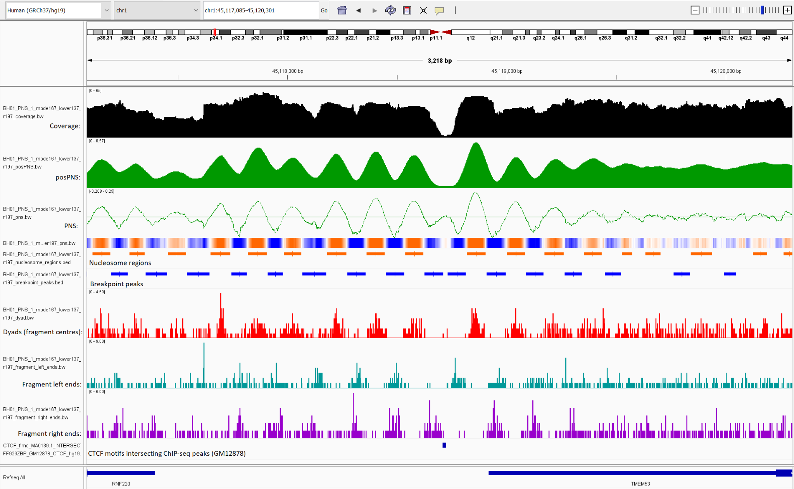

# NucleoSuite

NucleoSuite is a command-line toolkit for turning paired-end alignments or fragment intervals into reproducible genomic signals, peak calls, sequence profiles, spacing measurements, and coordinated workflows. It supports fragment preparation and QC, nucleosome-oriented and window-protection signals, coverage and fragment-coordinate tracks, cfDNA and MNase-seq analyses, matched CUT&RUN/CUT&Tag comparisons, chromatin-state and gene-centred analyses, and periodicity or cross-correlation measurements.

<p align="center">
  
</p>

*Example NucleoSuite track outputs generated from the BH01 plasma cfDNA sample from Snyder et al. (2016) and displayed in Integrative Genomics Viewer (IGV) v2.19.8, including coverage, positive PNS, PNS, nucleosome and breakpoint calls, fragment dyads, and fragment-end tracks.*

```bash
nucleosuite COMMAND [options]
```

Verify an installation with:

```bash
nucleosuite --version
nucleosuite --help
```

## What the suite can do

| Analysis area | Typical uses |
|---|---|
| Prepare fragments | Convert paired-end BAMs to fragment intervals, merge or randomize fragment sets, inspect fragment lengths, and build fragment heatmaps. |
| Build signals | Generate PNS, WPS, coverage, dyad, fragment-end, dinucleotide, and WW/SS sequence tracks, including several range-specific outputs in one pass. |
| Find and compare features | Call nucleosome, breakpoint, or WPS peaks; filter and annotate calls; compare positions; measure spacing; and estimate recurring periods or signal offsets. |
| Interpret genomic context | Aggregate signal around reference sites, extract regional profiles, stratify peaks by chromatin state, and relate signal or spacing to gene sets and expression. |
| Run complete analyses | Coordinate cfDNA, MNase-seq, and matched CUT&RUN/CUT&Tag workflows with randomized controls, replicate handling, clustering, statistical comparison, and reusable output manifests. |

The commands are composable: a signal or peak file produced by one command can be passed to downstream analysis commands, and existing chromosome-wise results can be combined or replotted without repeating the upstream calculation.

## Commands

### Fragment preparation

| Command | Function |
|---|---|
| [`fragments`](docs/commands/fragments.md) | Convert paired-end alignments to BED fragment intervals or combine fragment files. |
| [`merge-bams`](docs/commands/merge-bams.md) | Merge BAM files while retaining alignment records and tags. |
| [`randomize-fragments`](docs/commands/randomize-fragments.md) | Generate coordinate-randomized control fragments. |
| [`fragment-lengths`](docs/commands/fragment-lengths.md) | Calculate fragment-length counts and percentages. |
| [`fragment-heatmap`](docs/commands/fragment-heatmap.md) | Compare fragment-length profiles across samples or region classes. |

### Signal and sequence profiles

| Command | Function |
|---|---|
| [`tracks`](docs/commands/tracks.md) | Generate multiple range-specific signal, coordinate, and sequence tracks in one fragment pass. |
| [`pns`](docs/commands/pns.md) | Generate the probabilistic nucleosome score, its non-negative percent reference, and shared nucleosome/breakpoint peak calls. |
| [`wps`](docs/commands/wps.md) | Generate window protection score tracks and WPS peak calls. |
| [`coverage`](docs/commands/coverage.md) | Calculate per-base fragment coverage. |
| [`mean-scale`](docs/commands/mean-scale.md) | Express BigWig signal or BED-family scores relative to a calculated or supplied reference mean. |
| [`dyads`](docs/commands/dyads.md) | Generate fragment-centre tracks. |
| [`fragment-ends`](docs/commands/fragment-ends.md) | Generate combined, left-end, and right-end tracks. |
| [`dinuc-profile`](docs/commands/dinuc-profile.md) | Calculate positional dinucleotide profiles. |
| [`ww-types`](docs/commands/ww-types.md) | Classify fragments by centred WW/SS sequence patterns. |

### Peaks, spacing, and comparisons

| Command | Function |
|---|---|
| [`call-peaks`](docs/commands/call-peaks.md) | Call nucleosome/breakpoint or WPS features from an existing signal track. |
| [`empirical-peak-fdr`](docs/commands/empirical-peak-fdr.md) | Compare observed peaks with fragment-randomized peak callsets and report empirical p-values and FDR. |
| [`filter-peaks`](docs/commands/filter-peaks.md) | Filter peak intervals by score, percentile, length, or BigWig coverage. |
| [`peak-score-frequency`](docs/commands/peak-score-frequency.md) | Compare peak-score distributions. |
| [`peak-states`](docs/commands/peak-states.md) | Measure peak abundance and score-dependent enrichment by chromatin state. |
| [`compare-positions`](docs/commands/compare-positions.md) | Compare one main callset with one or more positional callsets and optional score comparators. |
| [`distances`](docs/commands/distances.md) | Calculate adjacent and higher-order distances between called positions. |
| [`flank-spacing`](docs/commands/flank-spacing.md) | Compare spacing between nucleosomes flanking categorized reference sites. |
| [`dac`](docs/commands/dac.md) | Calculate distance autocorrelation within one signal. |
| [`dcc`](docs/commands/dcc.md) | Calculate distance cross-correlation between two signals. |
| [`nrl`](docs/commands/nrl.md) | Estimate nucleosome repeat length from recurring DAC or DCC peaks. |
| [`positive-runs`](docs/commands/positive-runs.md) | Measure contiguous positive-signal intervals in a BigWig. |

### Regional and gene analyses

| Command | Function |
|---|---|
| [`aggregate`](docs/commands/aggregate.md) | Aggregate BigWig signal around genomic reference features. |
| [`region-extract`](docs/commands/region-extract.md) | Export region-level signal vectors and nearby peaks. |
| [`gene-sets`](docs/commands/gene-sets.md) | Define gene groups from chromatin-state overlaps. |
| [`gene-expression`](docs/commands/gene-expression.md) | Relate expression to peak spacing or signal periodicity. |
| [`tss-expression-quintiles`](docs/commands/tss-expression-quintiles.md) | Aggregate PNS or WPS signal around TSSs split into expression quintiles. |

### Coordinated workflows and utilities

| Command | Function |
|---|---|
| [`mnase-suite`](docs/commands/mnase-suite.md) | Run a coordinated MNase-seq analysis with signal, sequence, peak, spacing, and regional outputs. |
| [`cfdna-suite`](docs/commands/cfdna-suite.md) | Run a coordinated cfDNA fragmentomics and nucleosome-positioning analysis. |
| [`cutn-suite`](docs/commands/cutn-suite.md) | Run matched target/control CUT&RUN or CUT&Tag discovery, measurement, clustering, and optional two-condition comparison. |
| [`cutn-compare`](docs/commands/cutn-compare.md) | Compare Stage 1 clusters between two completed conditions. |
| [`combine`](docs/commands/combine.md) | Combine outputs from an existing chromosome-wise run. |
| [`chrom-sizes`](docs/commands/chrom-sizes.md) | Write chromosome names and lengths from a BAM or CRAM header. |
| [`resources`](docs/commands/resources.md) | List, locate, validate, or copy bundled resources. |
| [`validate-inputs`](docs/commands/validate-inputs.md) | Validate input integrity and reference compatibility before a run. |
| [`plot`](docs/commands/plot.md) | Recreate and customize applicable figures from existing NucleoSuite output tables. |

## Typical workflows

Start with the narrowest command that produces the data object you need. Use `pns` or `wps` for a single signal and its calls, `tracks` when several fragment-derived outputs share the same input pass, and the suite commands when the analysis includes multiple downstream products or replicate-aware stages. Use `combine` for existing chromosome-wise results and `plot` to regenerate or customize figures from saved tables.

A compact PNS run is:

```bash
nucleosuite pns \
  --bam sample.bam \
  --fasta genome.fa \
  --contigs chr1 chr2 \
  --cores 4 \
  --out-prefix sample
```

A multi-output pass is:

```bash
nucleosuite tracks \
  --bam sample.bam \
  --fasta genome.fa \
  --chrom-sizes genome.chrom.sizes \
  --spec-file track_spec.tsv \
  --output-dir tracks
```

For matched CUT&RUN/CUT&Tag data:

```bash
nucleosuite cutn-suite \
  --treatment1-bam target.bam \
  --control1-bam control.bam \
  --outdir target_cutn_suite \
  --cores 8
```

See the command pages and [Workflows](docs/WORKFLOWS.md) for mode estimation, replicate handling, clustering, statistical comparison, aggregate analyses, and output interpretation.

## Installation

NucleoSuite is intended to run in the supplied Conda environment. The recommended installation is to clone the repository, create that environment, build the package locally, and install the generated wheel. See [Installation](docs/INSTALLATION.md) for prerequisites, alternative installation methods, updates, and troubleshooting.

```bash
mamba env create -f environment.yml
conda activate nucleosuite
python -m build
python -m pip install --upgrade --force-reinstall --no-deps dist/*.whl
```

Verify the installed command with `nucleosuite --version` and `nucleosuite --help`.

## Documentation

- [Documentation index](docs/README.md)
- [Quick start](docs/QUICKSTART.md)
- [Choosing a command](docs/CHOOSING_A_COMMAND.md)
- [Workflows](docs/WORKFLOWS.md)
- [Command reference](docs/COMMAND_REFERENCE.md)
- [File formats](docs/FILE_FORMATS.md)
- [Output layout](docs/OUTPUT_LAYOUT.md)
- [Glossary](docs/GLOSSARY.md)
- [Algorithms](docs/ALGORITHMS.md)
- [Plot customization](docs/PLOTTING.md)

The command-line help is the authoritative reference for accepted options and defaults:

```bash
nucleosuite COMMAND --help
nucleosuite COMMAND --help-all
nucleosuite COMMAND --help-plotting
```

## References

1. Robinson JT, Thorvaldsdóttir H, Winckler W, Guttman M, Lander ES, Getz G, Mesirov JP. Integrative genomics viewer. *Nature Biotechnology*. 2011;29:24–26. [doi:10.1038/nbt.1754](https://doi.org/10.1038/nbt.1754).

2. Snyder MW, Kircher M, Hill AJ, Daza RM, Shendure J. Cell-free DNA comprises an in vivo nucleosome footprint that informs its tissues-of-origin. *Cell*. 2016;164(1–2):57–68. [doi:10.1016/j.cell.2015.11.050](https://doi.org/10.1016/j.cell.2015.11.050).
