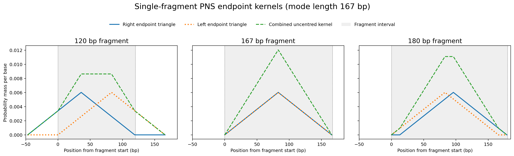
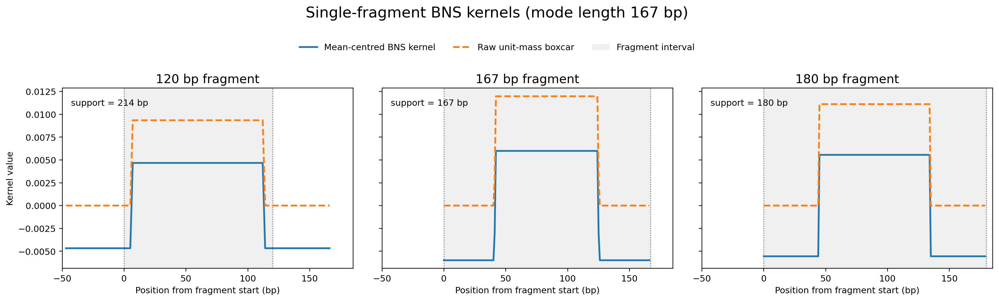
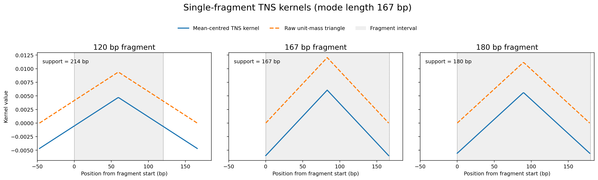
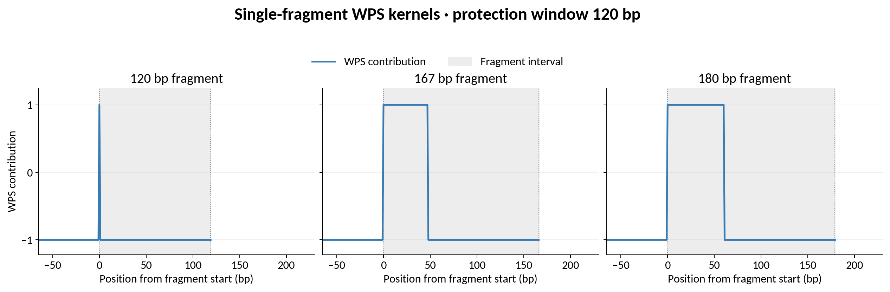
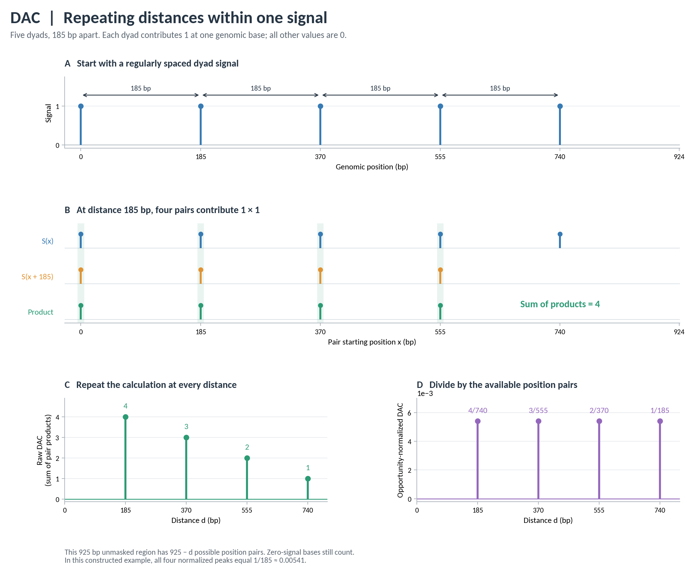

# Algorithms

This guide defines the calculations used by NucleoSuite. Command pages describe inputs, options, and outputs.

## Fragment coordinates and filtering

NucleoSuite represents each paired-end fragment as a zero-based, half-open interval $[s_i,e_i)$. The fragment starts at $s_i$, covers bases through $e_i-1$, and has length

```math
L_i=e_i-s_i.
```

BAM-derived fragments are filtered using the selected pairing, alignment, mapping-quality, fragment-length, contig, duplicate-coordinate, subsampling, and blacklist settings. Fragment BED, BED.gz, and bigBed inputs use the first three columns as the complete fragment interval.

If a fragment overlaps any selected blacklist base, that complete fragment is excluded before fragment-derived signals or sequence profiles are calculated.

## Probabilistic nucleosome scoring

Probabilistic nucleosome scoring (PNS) converts the boundaries of each accepted nucleosome-protected DNA fragment into a score for the nucleosome dyad: the central position of the nucleosome-bound DNA. In cfDNA, cleavage occurs more readily in exposed DNA than in DNA protected by a nucleosome or chromatosome. Fragment boundaries can therefore be treated as possible nucleosome entry or exit sites and used to predict where the dyad lies.

PNS makes one dyad prediction from each fragment end using a triangular distribution whose width is the selected modal protected-DNA length. For the default cfDNA mode of 167 bp, each distribution is zero at its associated fragment boundary, rises to its maximum at the 84th base inward, and then returns to zero. Each endpoint distribution has total mass 0.5, so their combined distribution has total mass 1 regardless of the observed fragment length.

The two endpoint distributions are added to form one distribution for the fragment. Their maxima coincide when the fragment length equals the selected mode. When the fragment is either longer or shorter than the selected mode, the two maxima are separated. The separation increases as the observed fragment length differs further from the selected mode.

PNS subtracts the mean of the combined distribution from every position in the fragment's scoring interval. The values contributed by one complete fragment then sum to zero. Values above the distribution mean become positive, and values below it become negative.

NucleoSuite adds these centred fragment contributions across the genome. Positive maxima identify positions with combined support for a nucleosome dyad. Negative minima identify positions compatible with fragment boundaries or cleavage. Per-fragment centring prevents a uniformly positive coverage background, so PNS requires no running-window background subtraction.

### Endpoint-derived dyad distributions

Let the selected modal protected-DNA length be $m$. Each fragment end contributes a symmetric triangular distribution spanning $m$ bases. For an odd value of $m$, the triangle has one maximum at the central base. For an even value of $m$, it has equal maxima at the two central bases. These maxima represent the expected nucleosome dyad inferred from that fragment boundary.

Let

```math
h=\left\lfloor\frac{m-1}{2}\right\rfloor,
\qquad
q=\left\lfloor\frac{m}{2}\right\rfloor.
```

For zero-based position $j$ within one endpoint triangle,

```math
p_m(j)=\frac{\min(j,m-1-j)}{2hq},
\qquad 0\le j<m,
```

and $p_m(j)=0$ outside the triangle.

Each endpoint triangle is normalized to total mass 0.5:

```math
\sum_j p_m(j)=0.5.
```

For an odd mode such as $m=167$, the distribution has one central maximum. With zero-based indexing, that maximum is at position 83:

```math
p_{167}(83)=\frac{1}{166}.
```

### Combining the two fragment ends

Let $n(L,m)$ be the number of genomic positions covered by the combined endpoint distribution for a fragment of length $L$ and a selected modal protected-DNA length $m$.

When the fragment length is at least the selected mode, this interval contains $L$ positions:

```math
n(L,m)=L\qquad(L\ge m).
```

When the fragment is shorter than the selected mode, the endpoint distributions extend beyond the fragment and together cover $2m-L$ positions:

```math
n(L,m)=2m-L\qquad(L\lt m).
```

For a fragment $[s,e)$, the left-end distribution occupies $[s,s+m)$ and rises inward from $s$. The right-end distribution occupies $[e-m,e)$ and rises inward from $e$. When $L\ge m$, their combined distribution is placed over the fragment interval $[s,e)$. When $L\lt m$, the two distributions extend beyond opposite fragment ends and cover $[e-m,s+m)$, an interval of length $2m-L$ centred on the central base or bases of the fragment.

Number the positions in this scoring interval from $j=0$ to $j=n(L,m)-1$. The left fragment end contributes $p_m(j)$. The right fragment end contributes $p_m(n(L,m)-1-j)$, which reverses the triangle so that it rises inward from the right boundary. Adding these contributions gives the endpoint distribution for the fragment:

```math
u_{m,L}(j)=p_m(j)+p_m\!\left(n(L,m)-1-j\right),
\qquad 0\le j<n(L,m).
```

Because each endpoint contributes 0.5,

```math
\sum_j u_{m,L}(j)=1.
```

When $L=m$, the dyad predicted from the left fragment end and the dyad predicted from the right fragment end coincide. When $L$ differs from $m$ in either direction, the two predicted dyads are separated. For an odd value of $m$, the distance between their maxima is $|L-m|$ bases.

#### Example PNS distributions

The figure below shows the endpoint-derived distributions for 120 bp, 167 bp, and 180 bp fragments using $m=167$ bp.



The x axis is measured from the fragment start, which is 0 bp. Grey shading marks the fragment interval from 0 to $L$ bp. For the 120 bp fragment, the 214 bp scoring support spans the coordinate interval from -47 to 167 bp and therefore extends 47 bp beyond both fragment boundaries.

For the 167 bp fragment, both endpoint-derived dyad distributions coincide. For the 120 bp and 180 bp fragments, their maxima are separated because each fragment length differs from the 167 bp mode. The separation is larger for the 120 bp fragment because its length differs further from the selected mode.

### Mean centring

The combined endpoint distribution has total mass 1 over $n(L,m)$ positions. Its mean before centring is

```math
\mu_{m,L}=\frac{1}{n(L,m)}.
```

PNS subtracts this mean from every position in the combined distribution:

```math
\psi_{m,L}(j)=u_{m,L}(j)-\frac{1}{n(L,m)}.
```

The resulting fragment contribution therefore sums to zero:

```math
\sum_j\psi_{m,L}(j)=0.
```

Positions receiving more support than the fragment-wide average become positive, while positions receiving less support become negative.

The genome-wide PNS track is the sum of the centred fragment contributions:

```math
PNS_m(x)=\sum_i\psi_{m,L_i}(x).
```

PNS represents population-level enrichment of nucleosome dyads across the genome, producing nucleosome occupancy tracts rather than discrete individual nucleosome positions. Local maxima within the PNS signal identify positions of greatest dyad enrichment within those tracts.

### `posPNS`

`posPNS` retains the combined endpoint distributions before mean centring:

```math
posPNS_m(x)=\sum_i u_{m,L_i}(x).
```

Because each fragment contributes total mass 1, `posPNS` reports the accumulated endpoint-derived positional support.

## Boxcar nucleosome scoring

Boxcar nucleosome scoring (BNS) uses the same accepted fragments and the same scoring support length as PNS, but replaces the two endpoint triangles with one symmetric central boxcar. The uncentred boxcar has total mass 1 and zero outer flanks. Mean centring produces a positive central contribution and negative flanks whose total contribution sums to zero for every fragment.

For fragment length $L$ and modal protected-DNA length $m$, BNS uses the same support length $n(L,m)$ defined above:

```math
n(L,m)=L\qquad(L\ge m),
```

and

```math
n(L,m)=2m-L\qquad(L\lt m).
```

The ideal centred BNS kernel assigns equal-magnitude positive values to the central half of this support and negative values to the two outer quarters. Because genomic positions are discrete, not every support length divides exactly into four equal blocks. NucleoSuite uses symmetric half-weight or zero transition positions so that the positive and negative contributions remain balanced and the kernel stays centred.

Let $n=4k+r$, where $r$ is 0, 1, 2, or 3, and let

```math
a=\frac{1}{n}.
```

The centred single-fragment BNS kernel is constructed as follows, from left to right:

| $r$ | Centred kernel layout |
|---:|---|
| 0 | $k$ values of $-a$, then $2k$ values of $+a$, then $k$ values of $-a$ |
| 1 | $k$ values of $-a$, then $+a/2$, then $2k-1$ values of $+a$, then $+a/2$, then $k$ values of $-a$ |
| 2 | $k$ values of $-a$, then 0, then $2k$ values of $+a$, then 0, then $k$ values of $-a$ |
| 3 | $k$ values of $-a$, then $-a/2$, then $2k+1$ values of $+a$, then $-a/2$, then $k$ values of $-a$ |

For every support length, the centred values satisfy

```math
\sum_j\psi^{BNS}_{m,L}(j)=0.
```

Adding the fragment-wide mean $1/n$ back to every position gives the uncentred BNS boxcar:

```math
u^{BNS}_{m,L}(j)=\psi^{BNS}_{m,L}(j)+\frac{1}{n(L,m)}.
```

Its outer flanks are zero and its total mass is 1:

```math
\sum_j u^{BNS}_{m,L}(j)=1.
```

The genome-wide tracks are

```math
BNS_m(x)=\sum_i\psi^{BNS}_{m,L_i}(x)
```

and

```math
posBNS_m(x)=\sum_i u^{BNS}_{m,L_i}(x).
```

For $m=167$ bp, a 120 bp fragment has support 214 bp and gives 53 negative positions, a zero transition, 106 positive positions, a second zero transition, and 53 negative positions. A 180 bp fragment has support 180 bp and gives 45 negative positions, 90 positive positions, and 45 negative positions. Odd support lengths use the half-weight transition rules above to preserve symmetry and exact zero-sum centring.

#### Example BNS distributions

The figure below shows the uncentred unit-mass boxcar and the resulting mean-centred BNS kernel for 120 bp, 167 bp, and 180 bp fragments using $m=167$ bp.



The x axis is measured from the fragment start, and grey shading marks the fragment interval. All three panels use the same x-axis limits so their kernel positions and widths can be compared directly.

BNS kernels are precomputed for every accepted fragment length and reused during genome-wide scoring, just as PNS kernels are.

## Triangular nucleosome scoring

Triangular nucleosome scoring (TNS) uses the same accepted fragments and the same fragment-length-dependent scoring support as PNS and BNS, but represents each fragment with one symmetric triangle centred on the fragment. The raw triangle has total mass 1 before mean centring.

For fragment length $L$ and modal protected-DNA length $m$, the support length is

```math
n(L,m)=L\qquad(L\ge m),
```

and

```math
n(L,m)=2m-L\qquad(L\lt m).
```

A fragment shorter than the mode therefore receives a wider scoring support. For example, with $m=167$ bp, a 137 bp fragment is 30 bp shorter than the mode and uses a 197 bp support. A 197 bp fragment also uses a 197 bp support because it is longer than the mode. The two fragments therefore use the same precomputed TNS kernel shape.

For a support of length $n$, number positions from $j=0$ to $j=n-1$ and define the unnormalised triangle

```math
q_n(j)=\min\left(j,n-1-j\right).
```

This makes the triangle zero at both support boundaries. Odd support lengths have one central maximum. Even support lengths have two equal central maximum values, producing a two-base plateau at the centre.

The uncentred unit-mass TNS kernel is

```math
u^{TNS}_{m,L}(j)=\frac{q_{n(L,m)}(j)}{\sum_k q_{n(L,m)}(k)}.
```

Therefore

```math
\sum_j u^{TNS}_{m,L}(j)=1.
```

The mean of this unit-mass distribution across the support is $1/n(L,m)$. TNS subtracts that value from every position:

```math
\psi^{TNS}_{m,L}(j)=u^{TNS}_{m,L}(j)-\frac{1}{n(L,m)}.
```

The centred fragment contribution therefore satisfies

```math
\sum_j\psi^{TNS}_{m,L}(j)=0.
```

The genome-wide TNS track is

```math
TNS_m(x)=\sum_i\psi^{TNS}_{m,L_i}(x),
```

while `posTNS` retains the non-negative unit-mass triangles before mean subtraction:

```math
posTNS_m(x)=\sum_i u^{TNS}_{m,L_i}(x).
```

TNS kernels are precomputed for every accepted fragment length and reused during genome-wide scoring.

#### Example TNS distributions

The figure below shows the uncentred unit-mass triangle and the resulting mean-centred TNS kernel for 120 bp, 167 bp, and 180 bp fragments using $m=167$ bp. The 120 bp fragment uses a 214 bp support, the 167 bp fragment uses a 167 bp support, and the 180 bp fragment uses a 180 bp support.



The x axis is measured from the fragment start, and grey shading marks the fragment interval. All three panels use the same x-axis limits.

### PNS peak calling

Positive PNS, BNS or TNS regions are genomic intervals where overlapping fragments collectively favour nucleosome protection. BNS and TNS use the same peak caller as PNS. Negative score regions can be called separately as breakpoint peaks.

A positive candidate region begins when the selected PNS, BNS or TNS signal rises above zero and ends when the permitted run of zero-or-negative values is exceeded. Regions shorter than `--min-region-length` are discarded. The output records each retained region, its midpoint as the representative position, and its highest score value as the region score.

Breakpoint calling applies the same procedure to the sign-inverted PNS, BNS or TNS signal, so negative regions are treated as positive during segmentation.

Text PNS, BNS and TNS BED scores are written as six-decimal floating-point values after `--peak-score-scale` is applied. For bigBed output, let $B$ be `--bigbed-score-scale`, which defaults to 1000:

```math
score_{bigBed}=\min\left(1000,\max\left(0,\mathrm{round}(B\,score_{BED})\right)\right).
```

Optional [Savitzky-Golay smoothing](https://doi.org/10.1021/ac60214a047) can be applied before peak calling. It fits a low-order polynomial within a moving window and evaluates the fitted value at the centre. Raw scoring signal is used by default.

Standalone `pns` uses PNS by default. Select `--scoring-method bns` for BNS or `--scoring-method tns` for TNS. `pns` and `cfdna-suite` use 137-197 bp fragments with $m=167$ bp by default. `mnase-suite` uses 120-180 bp fragments with $m=147$ bp.

## Windowed protection score

[Windowed protection score (WPS)](https://doi.org/10.1016/j.cell.2015.11.050) was introduced by Snyder et al. to infer nucleosome protection from cfDNA fragmentation. NucleoSuite's implementation was written to reproduce their L-WPS algorithm and default settings.

The default L-WPS fragment range is 120–180 bp and the protection-window width is $k=120$ bp.

### One fragment at one window centre

For fragment $i$ and a protection window centred at position $x$,

```math
\phi_{k,i}(x)=+1
```

when the fragment spans the complete protection window.

If a fragment endpoint lies inside the window,

```math
\phi_{k,i}(x)=-1.
```

Otherwise,

```math
\phi_{k,i}(x)=0.
```

For a fragment of length $L_i\ge k$, the single-fragment kernel therefore has a negative left flank, a positive central region, and a negative right flank. Each negative flank contains $k-1$ positions. The number of positions at which the full protection window fits inside the fragment is

```math
L_i-k+1.
```

For example, with a 120 bp protection window:

```math
120-120+1=1,
```

so a 120 bp fragment has one central +1 position.

A 167 bp fragment has

```math
167-120+1=48
```

positive positions, and a 180 bp fragment has

```math
180-120+1=61
```

positive positions.

If $L_i<k$, no complete $k$-base protection window fits inside the fragment, so the effective kernel contains only negative contributions.

#### Example WPS kernels



The x axis is measured from the fragment start, and grey shading marks the fragment interval. With the 120 bp protection window, the displayed kernel coordinates run from -59 to $L+59$ bp. All three panels use the same x-axis limits.

The positive central region becomes wider as fragment length increases because more window centres can be completely spanned by the fragment.

### Raw WPS

At each genomic position, NucleoSuite adds the contributions from all accepted fragments:

```math
WPS_k(x)=\sum_i\phi_{k,i}(x).
```

A locally elevated WPS value indicates stronger protection relative to the surrounding signal, whereas lower WPS values reflect greater influence from fragment endpoints. Because the raw WPS kernel is not centred on zero, the baseline of the WPS signal depends on sequencing depth. This is why NucleoSuite calculates mWPS by subtracting the local median WPS.

### Smoothing and baseline adjustment

NucleoSuite can smooth raw WPS with a Savitzky-Golay filter:

```math
WPS_{smoothed}(x)=SG_{w,p}(WPS)(x).
```

The default smoother uses a 21 bp window and polynomial order 2.

A 1,000 bp running median of the **raw** WPS provides the local baseline:

```math
B(x)=M_{1000}(WPS)(x).
```

Subtracting this baseline from raw WPS gives

```math
mWPS(x)=WPS(x)-B(x),
```

while subtracting the same baseline from smoothed WPS gives

```math
sm\_mWPS(x)=WPS_{smoothed}(x)-B(x).
```

The default WPS peak caller uses `sm_mWPS`.

### WPS peak calling

WPS peak calling takes a positive region of adjusted WPS and identifies its strongest peak-like part.

#### 1. Find positive candidate regions

NucleoSuite first finds positions where the selected WPS signal is greater than zero. Successive positive positions at most `--peak-merge-gap` bases apart are joined into one candidate region. The default merge distance is 5 bp, and any intervening bases are inserted into the candidate region with value zero.

Candidate regions shorter than `--peak-minlen` or longer than `--peak-maxregion` are discarded. The defaults are 50 bp and 450 bp.

#### 2. Keep the stronger part of each candidate region

NucleoSuite calculates the WPS caller's source-compatible regional median and keeps positions whose WPS values are at or above that median.

Those retained positions are divided into contiguous above-median blocks. These blocks represent the stronger parts of the broader positive region.

#### 3. Select the peak block

If the complete positive candidate region is 50-150 bp long, NucleoSuite selects the above-median block with the largest total WPS signal. For one block spanning positions $a$ through $b$, that total is

```math
A=\sum_{x=a}^{b}W(x).
```

The selected block itself is not required to be at least 50 bp long in this branch.

If the complete candidate region is longer than 150 bp, each above-median block is considered separately and only blocks between 50 and 150 bp are retained.

#### 4. Require a strong enough maximum

For each retained block, the maximum adjusted WPS must be strictly greater than `--peak-varicutoff`:

```math
\max_x W(x)>c.
```

The default cutoff is

```math
c=5.
```

#### 5. Report the call

The midpoint of the retained block is reported as the WPS call centre, and the maximum adjusted WPS within that block is used as its peak score.

Breakpoint calling applies the same procedure to the sign-inverted selected WPS signal.

#### Implementation detail

The WPS caller reproduces the block-building behaviour of the Snyder et al. source implementation. When the above-median positions contain a gap, the first above-median position encountered after that gap is not included when the next block is started. This affects the exact boundaries of some calls and is retained for source-compatible peak calling.

## Positive-signal runs

`positive-runs` finds continuous stretches of a BigWig signal that stay above a chosen threshold.

For signal $S(x)$ and threshold $\tau$, a run is a maximal interval $[a,b)$ for which

```math
S(x)>\tau
\qquad\text{for every }a\le x<b.
```

A run ends when the signal falls to or below the threshold, when a missing or non-finite value is encountered, at a blacklist mask, at a genomic gap, at a selected-region boundary, or at a contig boundary.

For each retained run, NucleoSuite reports its length, maximum signal, mean signal, and discrete signal area:

```math
A_{run}=\sum_{x=a}^{b-1}S(x).
```

Signal-specific peak callers may apply additional rules.

## Coverage, dyads, and fragment ends

These tracks describe different parts of the same accepted fragments.

### Coverage

For fragment $i=[s_i,e_i)$, every covered base from $s_i$ through $e_i-1$ receives a contribution of 1. If $C_i(x)$ is that per-fragment indicator, total coverage is

```math
C(x)=\sum_i C_i(x).
```

### Dyads

A dyad track places signal at the fragment centre.

For a fragment of length $L_i$, the right-hand central coordinate is

```math
d_i=s_i+\left\lfloor\frac{L_i}{2}\right\rfloor.
```

For an odd-length fragment this is the single central base. For an even-length fragment there are two central bases: $d_i-1$ and $d_i$.

With `--even-dyad split`, an even fragment contributes 0.5 to each central base. With `left` or `right`, the complete value 1 is placed on the selected central base.

### Fragment ends

The first and last covered bases are

```math
l_i=s_i,
\qquad
r_i=e_i-1.
```

The left-end track adds 1 at $l_i$, the right-end track adds 1 at $r_i$, and the combined end track adds both contributions.

`--max-per-coordinate` limits the maximum accumulated value that can be assigned to any single genomic base in sparse dyad or fragment-end tracks. It is applied after contributions have been accumulated at each coordinate and is separate from complete-fragment duplicate filtering.

## Dinucleotide profiles and WW/SS classes

### Dinucleotide profiles

Dinucleotide profiles align fragments by their right-hand central base:

```math
d_i=s_i+\left\lfloor\frac{L_i}{2}\right\rfloor.
```

If a dinucleotide begins at sequence index $a$ within the fragment, its relative coordinate is

```math
r=(s_i+a)-d_i.
```

At relative coordinate $r$, the fraction of dinucleotide $q$ is

```math
f_q(r)=\frac{C_q(r)}{N_{valid}(r)},
```

where $C_q(r)$ is the number of retained fragments carrying dinucleotide $q$ at that position and $N_{valid}(r)$ is the number of retained fragments that contribute a valid canonical sequence at that position.

Fragments are included in sequence profiles only when their complete extracted sequence contains A, C, G, or T exclusively.

Percentage output is

```math
100f_q(r).
```

WW and SS profiles first sum the counts of their constituent dinucleotides, then use the same denominator.

### WW/SS fragment classes

WW/SS classification follows the [method described by Wright and Cui (2019)](https://doi.org/10.1093/nar/gkz544). NucleoSuite extracts a 147 bp reference core centred on the central base or bases of the fragment and counts WW and SS dinucleotides at predefined minor-groove-associated and major-groove-associated positions.

There are 36 minor-groove-associated positions and 32 major-groove-associated positions. The major-groove counts are therefore placed on the same 36-position scale:

```math
C^{major,scaled}_q=\frac{36}{32}C^{major}_q,
```

where $q$ is WW or SS.

WW enrichment is

```math
E_{WW}=\left[C^{minor}_{WW}\ge C^{major,scaled}_{WW}\right],
```

and SS enrichment is

```math
E_{SS}=\left[C^{minor}_{SS}>C^{major,scaled}_{SS}\right].
```

The four fragment classes are then defined by the two Boolean results:

- `type1`: WW enriched, SS not enriched;
- `type2`: WW enriched, SS enriched;
- `type3`: WW not enriched, SS not enriched;
- `type4`: WW not enriched, SS enriched.

When contig-level results are combined, type percentages are recalculated from the summed type counts.

## Fragment-length counts and heatmap transformations

### Fragment-length counts

Fragment length is

```math
L_i=e_i-s_i.
```

`fragment-lengths` counts how many accepted fragments occur at each integer length.

When regions are supplied, a fragment is assigned using its midpoint

```math
m_i=\left\lfloor\frac{s_i+e_i}{2}\right\rfloor
```

and that point is tested against the half-open BED intervals.

The primary fragment-length TSV contains raw counts. `fragment-heatmap` can transform those counts for plotting.

### Fragment-size NRL

For the fragment-size NRL method, NucleoSuite forms an integer fragment-length profile over the requested NRL range. The default range begins at 100 bp and ends at the longest counted fragment or 1000 bp, whichever is shorter. Counts within this range are converted to density; this normalization changes the vertical scale but not the called summit positions.

The density profile uses the same resolution-based two-stage peak caller defined in [Nucleosome repeat length](#nucleosome-repeat-length). With the default resolution of 160 bp, broad multinucleosome peaks are detected after 51 bp smoothing and each summit is refined on a 21 bp-smoothed curve. Let the ordered fragment-size summits be

```math
L_1,L_2,L_3,\ldots
```

corresponding to mono-, di-, tri- and higher multinucleosome fragments. NucleoSuite fits

```math
L_j=\alpha+\lambda j+\varepsilon_j,
\qquad j=1,2,\ldots
```

and reports the slope $\lambda$ as the fragment-size NRL in base pairs per additional nucleosome. The intercept is fitted rather than forced through zero because the protected DNA length of the first fragment and accumulated linker DNA need not make the ladder pass through the origin.

The output reports peak count, $R^2$, slope standard error and mean adjacent peak spacing. Fewer than three retained peaks receive `insufficient_peaks`; $R^2<0.9$ receives `low_r_squared`. This method follows the fragment-size NRL strategy in [Bikova, Clarkson and Teif (2026)](https://academic.oup.com/nar/article/54/5/gkag074/8506906). It is reported separately from DAC/DCC distance NRL because the two methods can have different uncertainty and should not be silently mixed.

### Percentage within each profile

`profile-percent` makes each profile row sum to 100%:

```math
P_{ij}=100\frac{X_{ij}}{\sum_jX_{ij}},
```

where $X_{ij}$ is the count for profile $i$ and fragment length $j$.

### Percentage within each fragment length

`fragment-percent` instead makes each fragment-length column sum to 100% across profiles:

```math
F_{ij}=100\frac{X_{ij}}{\sum_iX_{ij}}.
```

### Fragment-length z-scores

The default `fragment-zscore` first converts each row to profile percentages $P_{ij}$. For each fragment length $j$, it then compares profiles using

```math
Z_{ij}=\frac{P_{ij}-\mu_j}{\sigma_j},
```

where $\mu_j$ and $\sigma_j$ are the population mean and population standard deviation across profiles for that fragment length. A column with zero variance is reported as zero.

### Min-max scaling

For either a profile row or fragment-length column, min-max scaling is

```math
M=\frac{X-X_{min}}{X_{max}-X_{min}}.
```

A row or column with zero range is returned as zero.

### Downsampling

Optional downsampling is performed before the heatmap transformation. Counts are clipped to non-negative values and rounded to integers.

For one profile with counts $n_j$ and total

```math
N=\sum_jn_j,
```

the sampling probability for fragment length $j$ is

```math
p_j=\frac{n_j}{N}.
```

If $N$ is greater than target $T$, NucleoSuite draws exactly $T$ fragments from a multinomial distribution using the probabilities $p_j$. Profiles already at or below $T$ are unchanged. `--downsample-to min` uses the smallest positive profile total as $T$.

## Peak distances

`distances` measures the separation between ordered peak positions within the same contig or state.

If the ordered positions are

```math
p_1,p_2,p_3,\ldots,
```

then the order-$q$ distance from peak $i$ is

```math
d_{i,q}=p_{i+q}-p_i.
```

Order 1 measures adjacent peaks. Order 2 skips one intervening peak, order 3 skips two, and so on.

For a histogram count $H(d)$ over the retained distances, the percentage at distance $d$ is

```math
H_{percent}(d)=100\frac{H(d)}{\sum_qH(q)}.
```

Pooled histograms, chromatin-state summaries, score-bin subsets, and optional NRL regressions are all derived from these measured distances.

## Distance autocorrelation

DAC compares a signal with itself at every positive distance $d$ to measure how much signal recurs at that separation.

### One pair at one distance

For signal $S(x)$, one valid pair of positions separated by $d$ contributes

```math
P_d(x)=S(x)S(x+d).
```

If either position has zero signal, the product is zero. If both positions have signal, the pair contributes their product.

For a binary dyad track, both values are either 0 or 1, so a matching pair contributes

```math
1\times1=1.
```

### Add all pairs within one region

For region $r$, raw DAC at distance $d$ is the sum of all valid pair products:

```math
DAC_r(d)=\sum_{x\in V_r(d)}S(x)S(x+d),
```

where $V_r(d)$ contains the valid starting positions whose partner $d$ bases away remains inside the same region and is not excluded by masking.

Pairs never cross a region boundary.

### Example: a periodic dyad signal

Consider five binary dyad peaks separated by 185 bp:

```text
position:   0        185        370        555        740
            |---------|----------|----------|----------|
            ●         ●          ●          ●          ●
```

There are **four** pairs separated by 185 bp:

```text
0   -> 185
185 -> 370
370 -> 555
555 -> 740
```

so

```math
DAC_{raw}(185)=4.
```

There are three pairs separated by 370 bp,

```math
DAC_{raw}(370)=3,
```

two pairs separated by 555 bp,

```math
DAC_{raw}(555)=2,
```

and one pair separated by 740 bp,

```math
DAC_{raw}(740)=1.
```



The raw DAC profile has peaks at the repeating distance and its multiples. Their decreasing height in this finite example reflects the smaller number of available pairs at larger multiples.

### Combine regions and tracks

When several regions are analysed, NucleoSuite calculates pair products within each region and then adds the raw values:

```math
DAC_{raw}(d)=\sum_t\sum_r DAC_{t,r}(d).
```

The same is done across multiple input BigWigs. Each BigWig is autocorrelated with itself; different BigWigs are not multiplied against one another in DAC.

### Correct for the number of possible pairs

Large distances usually have fewer genomic position pairs available for comparison. NucleoSuite therefore counts the number of valid opportunities at each distance.

For one region-track pair,

```math
O_{t,r}(d)=|V_{t,r}(d)|.
```

Across all regions and tracks,

```math
O(d)=\sum_t\sum_rO_{t,r}(d).
```

The default DAC value is the raw pair-product sum divided by the number of opportunities:

```math
DAC(d)=\frac{DAC_{raw}(d)}{O(d)}.
```

`--no-normalize-dac` reports the raw product sum.

### Derived DAC columns

After the principal DAC profile has been calculated, its percentage contribution is

```math
DAC_{percent}(d)=100\frac{DAC(d)}{\sum_{q=1}^{d_{max}}DAC(q)}.
```

If raw DAC is selected, the same percentage calculation uses the raw profile.

The separate signal-depth-scaled column starts from the raw product sum. If $T$ is the total retained signal,

```math
DAC_{per\ million}(d)=\frac{DAC_{raw}(d)}{T^2}\times10^6.
```

`--cpm-scale` can replace $10^6$ with another scale.

Sparse calculation enumerates non-zero signal pairs directly. FFT calculation evaluates the same autocorrelation from dense arrays. `--algorithm auto` chooses between them from signal density.

Missing or non-finite BigWig values are treated as zero signal but are still included when counting the genomic positions available for comparison. Blacklisted bases are excluded entirely from both the signal calculation and the number of available comparisons.

When chromosome-level DAC results are combined, raw DAC and opportunities are summed first. Normalized DAC, percentages, and depth-scaled values are then recalculated from those combined quantities.

## Distance cross-correlation

DCC compares signal $A$ with signal $B$ at signed lag $\ell$ to measure where one tends to occur relative to the other.

### One pair at one lag

For an A position at $x$, the contribution is

```math
P_\ell(x)=A(x)B(x+\ell).
```

The lag convention is

```math
\ell=p_B-p_A.
```

A positive lag means B lies downstream of A in the active coordinate orientation. A negative lag means B lies upstream. Minus-strand feature regions are reversed before calculation so this interpretation remains consistent in feature-oriented analyses.

### Add all pairs within one region

For one region,

```math
DCC_r(\ell)=\sum_{x\in V_r(\ell)}A(x)B(x+\ell).
```

### Example: B shifted downstream of A

Suppose signal A occurs at three positions and signal B occurs 10 bp downstream of each one:

```text
A:     ●----------------●----------------------●
       100              300                    530

B:       ●----------------●----------------------●
         110              310                    540
```

At lag $+10$ bp, all three A positions line up with B positions, so a binary signal gives

```math
DCC_{raw}(+10)=3.
```

A DCC maximum at +10 bp therefore indicates that B is repeatedly enriched 10 bp downstream of A.

### Combine regions and input tracks

Across regions,

```math
DCC_{raw}(\ell)=\sum_rDCC_r(\ell).
```

In BigWig mode, all A BigWigs are first added base-by-base within a region to form one A signal, and all B BigWigs are added in the same way to form one B signal. DCC is then calculated between those two combined signals. Because the signals are combined before multiplication, multiple A or B tracks can contribute cross-terms.

Missing or non-finite BigWig values are treated as zero signal but are still included when counting the genomic positions available for comparison. Blacklisted bases are excluded entirely from both the signal calculation and the number of available comparisons.

### Correct for the number of possible pairs

For one region, the opportunity count is

```math
O_r(\ell)=|V_r(\ell)|.
```

Total opportunities are summed across regions. The default DCC value is

```math
DCC(\ell)=\frac{DCC_{raw}(\ell)}{O(\ell)}.
```

`--no-normalize-dcc` reports the uncorrected raw profile.

If `--normalize-by-signal-totals` is also requested, the selected DCC profile is divided by

```math
T_AT_B,
```

where $T_A$ and $T_B$ are the total retained signal sums.

### Signed and absolute distances

With `--signed-lags`, NucleoSuite keeps negative and positive lags separately.

Without `--signed-lags`, direction is collapsed into absolute distance. For $d>0$, NucleoSuite first adds the raw values from $-d$ and $+d$:

```math
DCC_{raw,abs}(d)=DCC_{raw}(-d)+DCC_{raw}(+d).
```

The corresponding opportunities are also added:

```math
O_{abs}(d)=O(-d)+O(+d).
```

The normalized absolute-distance value is then

```math
DCC_{abs}(d)=\frac{DCC_{raw,abs}(d)}{O_{abs}(d)}.
```

Lag zero is included once:

```math
DCC_{raw,abs}(0)=DCC_{raw}(0),
\qquad
O_{abs}(0)=O(0).
```

Raw values and opportunities are therefore collapsed **before** normalization.

### Derived DCC columns

The percentage column is calculated from the complete reported DCC profile:

```math
DCC_{percent}(\ell)=100\frac{DCC(\ell)}{\sum_qDCC(q)}.
```

The signal-depth-scaled column starts from raw DCC:

```math
DCC_{per\ million}(\ell)=\frac{DCC_{raw}(\ell)}{T_AT_B}\times10^6.
```

`--cpm-scale` can replace $10^6$ with another scale.

Sparse enumeration and FFT calculate the same pair-product profile. Blacklisted bases are removed from both products and opportunities. Chromosome-wise combination sums raw DCC and opportunities before recalculating normalized and derived profiles.

## Nucleosome repeat length

`nrl` estimates the repeating distance between peaks in a DAC or DCC profile.

### Choose the peak resolution

Let the selected peak resolution be $R$ bp. Peaks reported by the long-range caller must be at least $R$ bp apart. The default is

```math
R=160\ \mathrm{bp}.
```

The same resolution determines two smoothing widths. Before smoothing, each requested width is rounded downward to the permitted series 11, 21, 31, 41, 51 bp, and so on. A value below 11 bp means no smoothing. Define

For values below 11 bp,

```math
Q(t)=1,\qquad t<11.
```

For values of at least 11 bp,

```math
Q(t)=10\left\lfloor\frac{t-1}{10}\right\rfloor+1,\qquad t\ge 11.
```

Here $Q=1$ represents no smoothing. The broad detection window is

```math
W_{detect}=Q\left(\frac{R}{3}\right),
```

and the finer local-maximum window is

```math
W_{local}=Q\left(\frac{R}{6}\right).
```

For the default $R=160$ bp,

```math
W_{detect}=51\ \mathrm{bp},
\qquad
W_{local}=21\ \mathrm{bp}.
```

For example, a requested 60 bp window becomes 51 bp, not 61 bp.

### Smooth at the two scales

For a smoothing width $W$, NucleoSuite averages profile values whose distance coordinates lie within $(W-1)/2$ bp of the current distance. If the input profile is $S(d)$, the smoothed value at profile coordinate $d_i$ is

```math
\widetilde{S}_W(d_i)=
\frac{1}{|V_i(W)|}
\sum_{j\in V_i(W)}S(d_j),
```

where

```math
V_i(W)=\left\{j:\left|d_j-d_i\right|\le\frac{W-1}{2}\right\}.
```

At the ends of the selected distance range, only available coordinates are averaged.

The broader $W_{detect}$ profile is used only to identify the repeating peak neighbourhoods. The finer $W_{local}$ profile is used to place the final peak positions and values.

### Detect the broad peaks

Local maxima are first found on the $W_{detect}$ profile. If two candidate maxima are closer than $R$, the stronger detection maximum is retained. This suppresses small wiggles around one broad NRL peak without requiring a perfectly monotonic rise and fall.

### Refine each peak position

For each retained detection peak, NucleoSuite looks within half a resolution on either side and selects the strongest local maximum from the finer $W_{local}$ profile. If the broad detection peak is at $d^{detect}$, the refinement neighbourhood is

```math
\left|d-d^{detect}\right|\le\frac{R}{2}.
```

The refined local maximum is the peak distance used for the NRL regression. Final reported peaks are again required to remain at least $R$ bp apart.

### Measure peak spacing

If the refined peak distances are

```math
d_1,d_2,d_3,\ldots,
```

the adjacent spacings are

```math
\Delta_j=d_{j+1}-d_j.
```

For example, peaks near 370, 555, 740, 925, and 1110 bp have adjacent spacings close to 185 bp.

### Fit the recurring period

NucleoSuite fits peak distance against peak number:

```math
d_j=\alpha+\lambda j+\varepsilon_j,
\qquad j=1,2,\ldots
```

The fitted slope $\lambda$ is the reported NRL or recurring-period estimate in base pairs per peak. The output also reports the intercept, $R^2$, slope standard error, and mean adjacent spacing.

Setting `--peak-resolution 0` disables resolution-based smoothing and peak separation. The cfDNA and MNase suites use this setting for their separate short-range periodicity summaries; their main long-range NRL analysis uses the configured NRL peak resolution.

## Regional aggregation

`aggregate` calculates the mean genomic signal around a set of reference features.

For each accepted feature $i$, NucleoSuite extracts signal $S_i(r)$ over relative coordinates from $-w$ to $+w$. Minus-strand features are reversed so negative coordinates remain upstream and positive coordinates remain downstream.

If every feature has a valid value at relative position $r$, the aggregate profile is the arithmetic mean:

```math
\overline{S}(r)=\frac{1}{N}\sum_{i=1}^{N}S_i(r).
```

When masking makes some feature-position values unavailable, NucleoSuite uses only the valid values. Let $I_i(r)=1$ when the value is valid and 0 otherwise. Then

```math
\overline{S}(r)=\frac{\sum_iI_i(r)S_i(r)}{\sum_iI_i(r)}.
```

Ordinary missing BigWig values are treated as zero by default and therefore remain in the denominator. Explicitly masked blacklist positions do not contribute to either the numerator or denominator.

The complete aggregate profile uses all accepted rows. `--max-heatmap-rows` and heatmap subsampling change the plotted heatmap matrix and its plotted-row mean, not the complete aggregate profile.

### Aggregate directional repeat length

Let the complete aggregate profile be $A(x)$ over signed positions $-w\le x\le w$. NucleoSuite applies the long-range resolution caller to this one complete profile. The profile is not divided at zero before smoothing or peak detection. For the default resolution $R=160$ bp, the unified curves are

```math
\widetilde{A}_{detect}(x)=\widetilde{A}_{51}(x),
\qquad
\widetilde{A}_{local}(x)=\widetilde{A}_{21}(x).
```

Both moving averages therefore use values from the opposite side of position 0 when their centred window crosses 0. Broad peaks are detected and refined across the full signed coordinate range using the same method described in [Nucleosome repeat length](#nucleosome-repeat-length).

Only after this unified peak call are peaks assigned to positive and negative regressions. Let $c$ be the called peak closest to 0 when it lies within half the calling resolution:

```math
c=\arg\min_{p:\lvert p\rvert\le R/2}\lvert p\rvert.
```

If no called peak lies within that interval, $c$ is absent. When present, $c$ is assigned peak number 0 in both directions. All remaining positive and negative peaks are sorted by increasing absolute distance and assigned directional peak numbers 1, 2, 3, and so on. For directional peak number $j$,

```math
d_j^+=\lvert p_j^+\rvert,
\qquad
d_j^-=\lvert p_j^-\rvert.
```

An inclusive signed exclusion interval $E=[e_{start},e_{end}]$ removes peaks from the regressions after numbering. By default, $E=[-R/2,+R/2]$ (−80 to +80 bp for $R=160$ bp). Explicit `--nrl-exclusion-start` and `--nrl-exclusion-end` bounds replace that interval, while `--no-nrl-exclusion` removes it. Regression membership additionally requires $d_{min}\le\lvert p\rvert\le d_{max}$. Directional numbers are not reassigned when an excluded peak is removed.

The retained distances are fitted independently:

```math
d_j^+=\alpha_+ + \lambda_+j+\varepsilon_j,
```

```math
d_j^-=\alpha_- + \lambda_-j+\varepsilon_j.
```

The slopes $\lambda_+$ and $\lambda_-$ are the positive- and negative-direction repeat lengths. The regression minimum, maximum and effective exclusion interval affect only regression membership; they do not crop the profile used for smoothing, peak calling or the unified peak plot. The profile plot marks every unified peak and shades the interval when exclusion is enabled.

## Gene-set assignment

`gene-sets` assigns genes to categories from the chromatin states that overlap them.

Each configured rule first creates a **candidate set**. `exclude_if_candidate` can then remove genes from a named final category when those genes also belong to specified competing candidate sets. The final named categories are mutually exclusive.

If a leftover category is requested, it contains only eligible genes that did not enter **any** candidate category:

```math
Leftover=EligibleGenes\setminus\bigcup_cCandidate_c.
```

A gene that entered a candidate category but was later excluded from its named final category is still not part of `leftover`.

## Gene-expression analyses

### Peak spacing versus expression

For each gene region, NucleoSuite orders its peak positions

```math
p_1,p_2,\ldots,p_n
```

and calculates adjacent spacings

```math
d_i=p_{i+1}-p_i.
```

The per-gene spacing statistic is the median of those adjacent distances. A gene with fewer than two peaks has no spacing value. Gene body, strand-aware upstream flank, and strand-aware downstream flank are calculated separately.

Expression is then transformed. The default spacing transform is

```math
E'=\log_2(E+1).
```

Across genes with finite spacing and expression values, NucleoSuite calculates the selected Pearson or Spearman correlation between the per-gene median spacing and transformed expression.

### FFT intensity versus expression

This analysis measures the association between gene expression and the strength of periodic signal around each gene.

For each eligible gene, NucleoSuite extracts a fixed strand-aware BigWig trajectory around the TSS. Signal processing is then applied in this order:

1. optionally apply the 24-coefficient recursive filter;
2. subtract the configured trimmed mean, using 10% from each tail by default;
3. remove a fitted linear trend;
4. subtract the remaining arithmetic mean;
5. apply the split-cosine/Tukey taper;
6. zero-pad to the requested FFT length;
7. calculate the real Fourier transform and raw periodogram intensity;
8. smooth the periodogram with the modified-Daniell kernel used by the implementation;
9. interpolate the spectrum onto integer periods in the requested range.

For an unmasked trajectory $y_x$ of length $N$, the unsmoothed periodogram is

```math
I(f)=\frac{|FFT(y)_f|^2}{N}.
```

With blacklist masking, centring and detrending are fitted using valid positions. Masked positions receive zero Fourier weight, and the denominator is the number of unmasked positions.

At each integer period, the resulting per-gene intensity is correlated with expression.

The default FFT expression transform is

```math
E'=\log_2\!\left(\max(E,0.04)\right).
```

For profile ranking, NucleoSuite first averages each gene's intensities across the configured ranking periods. With the default periods 193, 196, and 199 bp,

```math
R_i=\frac{I_i(193)+I_i(196)+I_i(199)}{3}.
```

The ranking correlation is then calculated across genes between $R_i$ and transformed expression. Profiles are ordered from the most negative correlation upward.

## Randomized fragment controls

Uniform randomization moves each accepted fragment to another valid coordinate on the same contig while preserving its fragment length.

Dinucleotide-matched randomization also preserves one selected terminal dinucleotide. NucleoSuite indexes valid placements in the active reference block and samples a placement whose selected terminal dinucleotide matches the source fragment.

A randomized placement must remain within the contig, contain canonical bases, differ from the source interval, and avoid the effective blacklist. `--fallback uniform|skip` controls what happens when no dinucleotide-matched placement can be found.

## Chromosome-wise execution and combination

Commands with a contig dimension can analyse independent contigs in parallel.

Additive quantities are summed across contigs. Derived percentages, correlations, aggregate means, and opportunity-corrected DAC/DCC values are recalculated from the combined counts, products, denominators, matrices, or source records.

Combined BigWigs are written in reference order. In `direct` mode, per-contig BigWig values are streamed into the combined output in bounded chunks. In `bedgraph` mode, validated run-length-compressed per-contig bedGraphs are combined in reference order and converted to the final BigWig.
