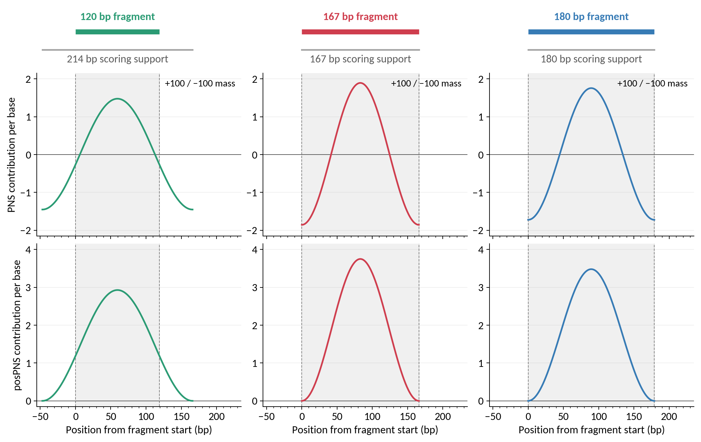
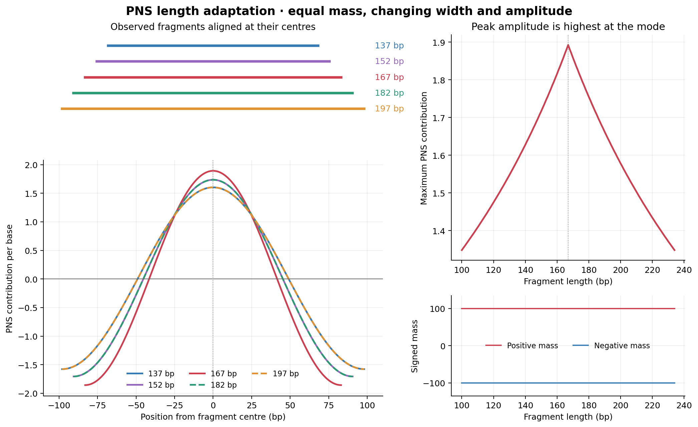
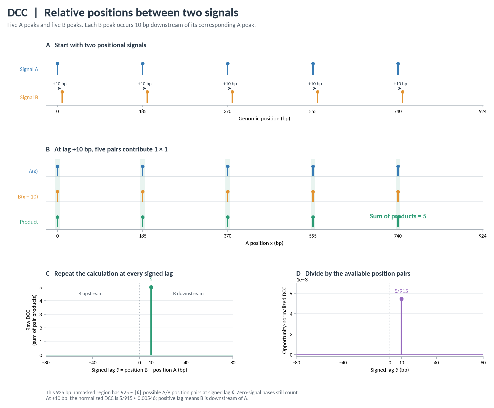

# Algorithms

This guide defines the calculations used by NucleoSuite. Command pages describe inputs, options, and outputs.

## Fragment coordinates and filtering

NucleoSuite represents each paired-end fragment as a zero-based, half-open interval $[s_i,e_i)$. The fragment starts at $s_i$, covers bases through $e_i-1$, and has length

```math
L_i=e_i-s_i.
```

BAM-derived fragments are filtered using the selected pairing, alignment, mapping-quality, fragment-length, contig, duplicate-coordinate, subsampling, and blacklist settings. Fragment BED, BED.gz, and bigBed inputs use the first three columns as the complete fragment interval.

If a fragment overlaps any selected blacklist base, that complete fragment is excluded before fragment-derived signals or sequence profiles are calculated.

### BigWig missing values and masks

Unless a command-specific section states otherwise, signal comparisons treat missing or non-finite BigWig values as zero while still counting those genomic positions as available comparisons. Blacklisted bases are excluded from both signal calculations and opportunity counts.


## Probabilistic nucleosome scoring

Probabilistic Nucleosome Scoring (PNS) converts paired-end fragment geometry into a signed, nucleosome-centred signal. Each accepted fragment contributes one symmetric sinusoidal wave: positive support near its centre and negative support toward the outer parts of its scoring interval. The selected protected-DNA mode determines how sharply the fragment localizes that support. Fragments at the mode produce the narrowest, highest wave; fragments farther from the mode produce broader, lower waves while preserving their total contribution.

The standalone [`pns`](commands/pns.md) command builds this signal and calls nucleosome regions and breakpoint peaks. [`tracks`](commands/tracks.md) calculates the same PNS kernels alongside coverage, dyads, fragment ends, WPS or sequence profiles. The cfDNA, MNase and CUT&RUN/CUT&Tag workflows use this same implementation.

### Fragment geometry and the protected-DNA mode

Let a fragment occupy the zero-based, half-open interval $[s,e)$, with length $L=e-s$. Its geometric centre on the genomic base grid is

```math
c=\frac{s+e-1}{2}.
```

The mode $m$ is the protected-DNA length that receives the most localized positional support. Standalone `pns` estimates it automatically from accepted fragments, or uses the supplied `--mode` / `--mode-length`. The default scoring range is the resolved mode plus or minus 30 bp; explicit fragment bounds override either side independently. Mode estimation and selection of the scoring range are separate steps. See [fragment-mode estimation](#bootstrap-stabilized-fragment-mode-estimation) for sampling, bootstrap uncertainty and stopping criteria.

### Length-dependent support width

The number of genomic bins occupied by the wave is

```math
W(L,m)=m+|L-m|=\max(L,2m-L).
```

For $L\ge m$, the support is exactly the observed fragment interval. For $L<m$, it extends by $m-L$ bases beyond **each** fragment end. Define its left coordinate as

```math
a=s-\max(0,m-L).
```

The support is $[a,a+W)$ and has the same centre as the fragment. Its width is smallest at $L=m$ and increases equally for equal departures above or below the mode.

For a mode of 167 bp, the following fragments illustrate the geometry:

| Fragment length $L$ | Distance from mode | Support width $W$ | Extension beyond each fragment end |
|---:|---:|---:|---:|
| 120 bp | 47 bp | 214 bp | 47 bp |
| 137 bp | 30 bp | 197 bp | 30 bp |
| 152 bp | 15 bp | 182 bp | 15 bp |
| 167 bp | 0 bp | 167 bp | 0 bp |
| 182 bp | 15 bp | 182 bp | 0 bp |
| 197 bp | 30 bp | 197 bp | 0 bp |

Thus 137 bp and 197 bp fragments have the same wave shape when aligned at their centres, despite different observed fragment spans. The shorter fragment's wave extends beyond its observed endpoints. At the mode, and for longer fragments, the negative minima lie at the observed outermost bases; for shorter fragments they lie at the extended support boundaries.

Because $W$ and $L$ always have the same parity, their centres coincide exactly. Odd lengths have one central genomic bin; even lengths have two central bins around a half-base midpoint. The wave preserves that symmetry without shifting the fragment centre.

### Sampling the sinusoidal shape

For local bin $j=0,\ldots,W-1$, PNS samples one inverted cosine cycle:

```math
q_W(j)=-\cos\left(\frac{2\pi j}{W-1}\right).
```

The first and last bins have value $-1$. Odd widths have a single central value of $+1$; even widths have two equal central maxima. Samples within floating-point tolerance of zero are set to zero before normalization.

PNS constructs the signed wave directly. Its normalization uses the actual sampled genomic bins, so odd/even widths and the duplicated negative endpoint are accounted for explicitly.

### Probability mass represented in percent

Define the sums of the positive samples and the magnitudes of the negative samples:

```math
A_+(W)=\sum_{j:q_W(j)>0}q_W(j),
\qquad
A_-(W)=\sum_{j:q_W(j)<0}|q_W(j)|.
```

The central and flank distributions are normalized separately. Each is non-negative and has total probability represented as **100 percent**:

```math
p^+_W(j)=100\frac{\max(q_W(j),0)}{A_+(W)},
\qquad
p^-_W(j)=100\frac{\max(-q_W(j),0)}{A_-(W)}.
```

The signed contribution is their difference:

```math
k_W(j)=p^+_W(j)-p^-_W(j).
```

Equivalently, positive cosine samples are multiplied by $100/A_+$ and negative samples by $100/A_-$. These factors can differ slightly because normalization is discrete. The resulting kernel retains its left-right symmetry and satisfies

```math
\sum_j p^+_W(j)=100,
\qquad
\sum_j p^-_W(j)=100,
```

```math
\sum_{j:k_W(j)>0}k_W(j)=100,
\qquad
\sum_{j:k_W(j)<0}k_W(j)=-100,
```

```math
\sum_j k_W(j)=0,
\qquad
\sum_j |k_W(j)|=200.
```

Here **mass** means the sum over genomic bins, not the maximum height. The +100 and −100 values are the summed signed contributions of the two lobes; the peak height depends on the support width. Wider waves distribute the same positive and negative mass across more bins, lowering their amplitude as fragment length departs from the mode. Every complete accepted fragment therefore has the same total absolute weight of 200, independent of its length.

The positive and negative distributions describe two kinds of positional support. Their values are not complementary probabilities that sum to 100 at each genomic position. Negative PNS values encode the negative contribution of the flank distribution; they are not negative probabilities. This geometric scoring model provides positional evidence rather than a calibrated posterior probability of nucleosome occupancy.

### Example PNS kernels and fragment spans

The first figure shows the observed fragment above each kernel, with genomic position zero at the fragment start. Dashed vertical lines mark the observed outermost bases. The 120 bp fragment at mode 167 bp extends 47 bp in each direction and spans 214 bins. All three panels share the same score scale.



The second figure aligns fragments at their geometric centres. Lengths equally far from the 167 bp mode have matching waves: blue/yellow for 137/197 bp and purple/green for 152/182 bp. Dashed curves identify the longer fragment in each overlapping pair. The upper-right panel shows the maximum value of a single-fragment kernel as fragment length changes, with the highest amplitude at the mode. The lower-right panel sums each signed lobe across all support bins: +100 and −100 at every length, giving total absolute mass 200. These are integrated masses, not peak heights.



The figures are generated directly from the scoring implementation by [`examples/plot_pns_kernels.py`](../examples/plot_pns_kernels.py). PNG and SVG versions are included.

### Accumulating a genomic PNS signal

For accepted fragments indexed by $i$, each kernel is placed at its support start $a_i$ and the contributions are added:

```math
PNS_m(x)=\sum_i k_{W_i}(x-a_i).
```

A kernel contributes zero outside its support. Overlapping fragment centres reinforce positive signal, while flanking contributions can cancel or outweigh central support. Positive regions identify recurrent nucleosome-centred protection; negative regions identify recurrent flank or breakpoint support.

The BigWig stores this sum in its **native score units**. PNS and `posPNS` tracks are not automatically divided by a reference mean or multiplied after accumulation. Because many fragments can contribute at the same position, a genomic score can exceed 100 and depends on fragment abundance. The 100-percent normalization applies separately to each single-fragment positional distribution. Subtracting the flank distribution from the central distribution gives +100/−100 signed mass and total absolute mass 200 per complete kernel; it does not normalize the accumulated genomic track.

### The non-negative reference track: `posPNS`

For each individual fragment, the complete signed wave is translated vertically until its minimum is zero:

```math
u_W(j)=k_W(j)-\min_t k_W(t),
\qquad 0\le j<W.
```

The reference track is the sum of these translated kernels:

```math
posPNS_m(x)=\sum_i u_{W_i}(x-a_i).
```

This translation preserves the support width, centre, symmetry and differences between bins. **`posPNS` is distinct from the positive lobe $p^+$.** It includes the entire translated wave, is not clipped at the original zero crossing, and is not renormalized to a mass of 100. Translation occurs per fragment before summation, not by shifting the completed genomic PNS track.

`posPNS` is an auxiliary non-negative support track. PNS peak calling uses the signed PNS signal. The standard workflows retain native `posPNS` values alongside PNS.

### Optional smoothing

Raw PNS is used by default (`--smooth-window 0`; `tracks` uses `--score-smooth-window 0`). An explicitly requested Savitzky–Golay filter produces `pns_smoothed`, and peak calling then uses that smoothed signal. The window must be an odd integer of at least three and exceed the polynomial order. Smoothing acts on the summed signal; the per-fragment mass identities above describe the kernels before this optional processing.


### PNS peak calling

Positive PNS regions are genomic intervals where overlapping fragments collectively favour nucleosome protection. Negative score regions can be called separately as breakpoint peaks.

A positive candidate region begins when the selected PNS signal rises above zero and ends when the permitted run of zero-or-negative values is exceeded. Regions shorter than `--min-region-length` are discarded. The output records each retained region, its midpoint as the representative position, and its highest score value as the region score.

Breakpoint calling applies the same procedure to the sign-inverted PNS signal, so negative regions are treated as positive during segmentation.

Text PNS BED scores are written as six-decimal floating-point values after `--peak-score-scale` is applied. For bigBed output, let $B$ be `--bigbed-score-scale`. The default is $B=1$; this conversion affects only the integer bigBed score field:

```math
score_{bigBed}=\min\left(1000,\max\left(0,\mathrm{round}(B\,score_{BED})\right)\right).
```

Optional [Savitzky-Golay smoothing](https://doi.org/10.1021/ac60214a047) can be applied before peak calling. It fits a low-order polynomial within a moving window and evaluates the fitted value at the centre. Raw scoring signal is used by default.

`pns` estimates $m$ automatically from the accepted fragments unless an integer `--mode` is supplied. The cfDNA and MNase suites use their workflow-specific protected-DNA settings.


## Dyads

A dyad track places signal at the fragment centre.

For a fragment of length $L_i$, the right-hand central coordinate is

```math
d_i=s_i+\left\lfloor\frac{L_i}{2}\right\rfloor.
```

For an odd-length fragment this is the single central base. For an even-length fragment there are two central bases: $d_i-1$ and $d_i$.

With `--even-dyad split`, an even fragment contributes 0.5 to each central base. With `left` or `right`, the complete value 1 is placed on the selected central base.

For example, with zero-based, half-open BED coordinates:

| Fragment interval | Length | First / last covered bases | Default dyad contributions |
|---|---:|---|---|
| `[100,267)` | 167 bp | 100 / 266 | 1 at position 183 |
| `[100,268)` | 168 bp | 100 / 267 | 0.5 at 183 and 0.5 at 184 |

The BED end coordinate is excluded. This is why the right-end signal is placed at `end − 1`, not at `end`.


## Fragment ends

The first and last covered bases are

```math
l_i=s_i,
\qquad
r_i=e_i-1.
```

The left-end track adds 1 at $l_i$, the right-end track adds 1 at $r_i$, and the combined end track adds both contributions.

`--max-per-coordinate` limits the maximum accumulated value that can be assigned to any single genomic base in sparse dyad or fragment-end tracks. It is applied after contributions have been accumulated at each coordinate and is separate from complete-fragment duplicate filtering.


## Coverage

For fragment $i=[s_i,e_i)$, every covered base from $s_i$ through $e_i-1$ receives a contribution of 1. If $C_i(x)$ is that per-fragment indicator, total coverage is

```math
C(x)=\sum_i C_i(x).
```


## Distance autocorrelation

DAC compares a signal with itself at every positive distance $d$ to measure how much signal recurs at that separation.

### One pair at one distance

For signal $S(x)$, one valid pair of positions separated by $d$ contributes

```math
P_d(x)=S(x)S(x+d).
```

If either position has zero signal, the product is zero. If both positions have signal, the pair contributes their product.

For a binary dyad track, both values are either 0 or 1, so a matching pair contributes

```math
1\times1=1.
```

### Add all pairs within one region

For region $r$, raw DAC at distance $d$ is the sum of all valid pair products:

```math
DAC_r(d)=\sum_{x\in V_r(d)}S(x)S(x+d),
```

where $V_r(d)$ contains the valid starting positions whose partner $d$ bases away remains inside the same region and is not excluded by masking.

Pairs never cross a region boundary.

### Example: a periodic dyad signal

Consider five binary dyad peaks separated by 185 bp:

The positions are 0, 185, 370, 555, and 740 bp; each has value 1.

There are **four** pairs separated by 185 bp:

| First dyad | Second dyad | Separation | Product |
|---:|---:|---:|---:|
| 0 | 185 | 185 bp | 1 |
| 185 | 370 | 185 bp | 1 |
| 370 | 555 | 185 bp | 1 |
| 555 | 740 | 185 bp | 1 |

so

```math
DAC_{raw}(185)=4.
```

There are three pairs separated by 370 bp,

```math
DAC_{raw}(370)=3,
```

two pairs separated by 555 bp,

```math
DAC_{raw}(555)=2,
```

and one pair separated by 740 bp,

```math
DAC_{raw}(740)=1.
```


The raw DAC profile has peaks at the repeating distance and its multiples. Their decreasing height in this finite example reflects the smaller number of available pairs at larger multiples.

The figure follows the calculation from top to bottom: the input dyads, the four matching pairs at 185 bp, and the raw and normalized profiles. The right-hand profile divides by all eligible genomic position pairs, including zero-valued pairs; the worked normalization table below uses the same 925 bp region.

### Combine regions and tracks

When several regions are analysed, NucleoSuite calculates pair products within each region and then adds the raw values:

```math
DAC_{raw}(d)=\sum_t\sum_r DAC_{t,r}(d).
```

The same is done across multiple input BigWigs. Each BigWig is autocorrelated with itself; different BigWigs are not multiplied against one another in DAC.

### Correct for the number of possible pairs

Large distances usually have fewer genomic position pairs available for comparison. NucleoSuite therefore counts the number of valid opportunities at each distance.

For one region-track pair,

```math
O_{t,r}(d)=|V_{t,r}(d)|.
```

Across all regions and tracks,

```math
O(d)=\sum_t\sum_rO_{t,r}(d).
```

The default DAC value is the raw pair-product sum divided by the number of opportunities:

```math
DAC(d)=\frac{DAC_{raw}(d)}{O(d)}.
```

`--no-normalize-dac` reports the raw product sum.

An opportunity is an eligible pair of genomic positions, including pairs whose signal product is zero. It is not limited to pairs of non-zero dyads. In one unmasked 925 bp region, there are `925 − d` opportunities at distance `d`. For the five-dyad example above:

| Distance | Raw DAC | Opportunities | Default DAC value |
|---:|---:|---:|---:|
| 185 bp | 4 | 740 | 4 / 740 ≈ 0.005405 |
| 370 bp | 3 | 555 | 3 / 555 ≈ 0.005405 |
| 555 bp | 2 | 370 | 2 / 370 ≈ 0.005405 |
| 740 bp | 1 | 185 | 1 / 185 ≈ 0.005405 |

The normalized peaks happen to be equal in this constructed example; real profiles need not be. For a weighted track, a pair with values 2 and 3 contributes 6 to the raw sum, so DAC is not always a count of dyad pairs. Neither raw nor opportunity-normalized DAC is bounded like a Pearson correlation coefficient.

### Derived DAC columns

After the principal DAC profile has been calculated, its percentage contribution is

```math
DAC_{percent}(d)=100\frac{DAC(d)}{\sum_{q=1}^{d_{max}}DAC(q)}.
```

If raw DAC is selected, the same percentage calculation uses the raw profile.

The separate signal-depth-scaled column starts from the raw product sum. If $T$ is the total retained signal,

```math
DAC_{per\ million}(d)=\frac{DAC_{raw}(d)}{T^2}\times10^6.
```

`--cpm-scale` can replace $10^6$ with another scale.

Sparse calculation enumerates non-zero signal pairs directly. FFT calculation evaluates the same autocorrelation from dense arrays. `--algorithm auto` chooses between them from signal density.

BigWig inputs follow the [shared missing-value and blacklist convention](#bigwig-missing-values-and-masks).

When chromosome-level DAC results are combined, raw DAC and opportunities are summed first. Normalized DAC, percentages, and depth-scaled values are then recalculated from those combined quantities.


## Distance cross-correlation

DCC compares signal $A$ with signal $B$ at signed lag $\ell$ to measure where one tends to occur relative to the other.

### One pair at one lag

For an A position at $x$, the contribution is

```math
P_\ell(x)=A(x)B(x+\ell).
```

The lag convention is

```math
\ell=p_B-p_A.
```

A positive lag means B lies downstream of A in the active coordinate orientation. A negative lag means B lies upstream. Minus-strand feature regions are reversed before calculation so this interpretation remains consistent in feature-oriented analyses.

### Add all pairs within one region

For one region,

```math
DCC_r(\ell)=\sum_{x\in V_r(\ell)}A(x)B(x+\ell).
```

### Example: B shifted downstream of A

Suppose signal A occurs at three positions and signal B occurs 10 bp downstream of each one:

| A position | Corresponding B position | Lag: B − A |
|---:|---:|---:|
| 100 | 110 | +10 bp |
| 300 | 310 | +10 bp |
| 530 | 540 | +10 bp |

At lag $+10$ bp, all three A positions line up with B positions, so a binary signal gives

```math
DCC_{raw}(+10)=3.
```

A DCC maximum at +10 bp therefore indicates that B is repeatedly enriched 10 bp downstream of A.



The figure uses `--signed-lags` and an unmasked 640 bp region. Its alignment panel shows where `B(x+10)` coincides with `A(x)`; the three products produce the +10 bp peak. The two lower panels show the same result before and after opportunity normalization.

### Combine regions and input tracks

Across regions,

```math
DCC_{raw}(\ell)=\sum_rDCC_r(\ell).
```

In BigWig mode, all A BigWigs are first added base-by-base within a region to form one A signal, and all B BigWigs are added in the same way to form one B signal. DCC is then calculated between those two combined signals. Because the signals are combined before multiplication, multiple A or B tracks can contribute cross-terms.

BigWig inputs follow the [shared missing-value and blacklist convention](#bigwig-missing-values-and-masks).

### Correct for the number of possible pairs

For one region, the opportunity count is

```math
O_r(\ell)=|V_r(\ell)|.
```

Total opportunities are summed across regions. The default DCC value is

```math
DCC(\ell)=\frac{DCC_{raw}(\ell)}{O(\ell)}.
```

`--no-normalize-dcc` reports the uncorrected raw profile.

For the +10 bp example in one unmasked 640 bp region, there are `640 − 10 = 630` opportunities, including pairs with zero product. The default signed DCC at +10 bp is therefore `3 / 630 ≈ 0.004762`. This is a mean product of signal values, not a Pearson correlation coefficient.

If `--normalize-by-signal-totals` is also requested, the selected DCC profile is divided by

```math
T_AT_B,
```

where $T_A$ and $T_B$ are the total retained signal sums.

### Signed and absolute distances

With `--signed-lags`, NucleoSuite keeps negative and positive lags separately.

Without `--signed-lags`, direction is collapsed into absolute distance. For $d>0$, NucleoSuite first adds the raw values from $-d$ and $+d$:

```math
DCC_{raw,abs}(d)=DCC_{raw}(-d)+DCC_{raw}(+d).
```

The corresponding opportunities are also added:

```math
O_{abs}(d)=O(-d)+O(+d).
```

The normalized absolute-distance value is then

```math
DCC_{abs}(d)=\frac{DCC_{raw,abs}(d)}{O_{abs}(d)}.
```

Lag zero is included once:

```math
DCC_{raw,abs}(0)=DCC_{raw}(0),
\qquad
O_{abs}(0)=O(0).
```

Raw values and opportunities are therefore collapsed **before** normalization.

For the same example, raw DCC is 3 at +10 bp and 0 at −10 bp, with 630 opportunities in each direction:

| Output | Raw products | Opportunities | Default value |
|---|---:|---:|---:|
| Signed +10 bp | 3 | 630 | 0.004762 |
| Signed −10 bp | 0 | 630 | 0 |
| Absolute 10 bp | 3 + 0 | 630 + 630 | 0.002381 |

The absolute-distance result answers whether the signals recur 10 bp apart in either direction. It does not retain the direction of the signed peak, and its normalized height need not equal that peak's height.

### Derived DCC columns

The percentage column is calculated from the complete reported DCC profile:

```math
DCC_{percent}(\ell)=100\frac{DCC(\ell)}{\sum_qDCC(q)}.
```

The signal-depth-scaled column starts from raw DCC:

```math
DCC_{per\ million}(\ell)=\frac{DCC_{raw}(\ell)}{T_AT_B}\times10^6.
```

`--cpm-scale` can replace $10^6$ with another scale.

Sparse enumeration and FFT calculate the same pair-product profile. Blacklisted bases are removed from both products and opportunities. Chromosome-wise combination sums raw DCC and opportunities before recalculating normalized and derived profiles.


## Nucleosome repeat length

`nrl` estimates the repeating distance between peaks in a DAC or DCC profile.

### Choose the peak resolution

Let the selected peak resolution be $R$ bp. Peaks reported by the long-range caller must be at least $R$ bp apart. The default is

```math
R=160\ \mathrm{bp}.
```

The same resolution determines two smoothing widths. Before smoothing, each requested width is rounded downward to the permitted series 11, 21, 31, 41, 51 bp, and so on. A value below 11 bp means no smoothing. Define

```math
Q(t)=10\left\lfloor\frac{\max(t-1,0)}{10}\right\rfloor+1.
```

Here $Q=1$ represents no smoothing. The broad detection window is

```math
W_{detect}=Q\left(\frac{R}{2.5}\right),
```

and the finer local-maximum window is

```math
W_{local}=Q\left(\frac{R}{6}\right).
```

For the default $R=160$ bp,

```math
W_{detect}=61\ \mathrm{bp},
\qquad
W_{local}=21\ \mathrm{bp}.
```

For example, the default broad-window target is 64 bp and is snapped down to 61 bp.

| Resolution | Broad detection window | Finer refinement window | Minimum retained peak separation |
|---:|---:|---:|---:|
| 120 bp | 41 bp | 11 bp | 120 bp |
| 130 bp | 51 bp | 21 bp | 130 bp |
| 160 bp | 61 bp | 21 bp | 160 bp |
| 200 bp | 71 bp | 31 bp | 200 bp |

Resolution controls how closely peaks may be called; it does not set the fitted NRL to that number. A 160 bp resolution can, for example, retain a peak series spaced 185 bp apart and report an NRL near 185 bp.

### Smooth at the two scales

For a smoothing width $W$, NucleoSuite averages profile values whose distance coordinates lie within $(W-1)/2$ bp of the current distance. If the input profile is $S(d)$, the smoothed value at profile coordinate $d_i$ is

```math
\widetilde{S}_W(d_i)=
\frac{1}{|V_i(W)|}
\sum_{j\in V_i(W)}S(d_j),
```

where

```math
V_i(W)=\left\{j:\left|d_j-d_i\right|\le\frac{W-1}{2}\right\}.
```

At the ends of the selected distance range, only available coordinates are averaged.

The broader $W_{detect}$ profile is used only to identify the repeating peak neighbourhoods. The finer $W_{local}$ profile is used to place the final peak positions and values.

### Detect the broad peaks

Local maxima are first found on the $W_{detect}$ profile. If two candidate maxima are closer than $R$, the stronger detection maximum is retained. This suppresses small wiggles around one broad NRL peak without requiring a perfectly monotonic rise and fall.

### Refine each peak position

For each retained detection peak, NucleoSuite looks within half a resolution on either side and selects the strongest local maximum from the finer $W_{local}$ profile. If the broad detection peak is at $d^{detect}$, the refinement neighbourhood is

```math
\left|d-d^{detect}\right|\le\frac{R}{2}.
```

The refined local maximum is the peak distance used for the NRL regression. Final reported peaks are again required to remain at least $R$ bp apart.

### Measure peak spacing

If the refined peak distances are

```math
d_1,d_2,d_3,\ldots,
```

the adjacent spacings are

```math
\Delta_j=d_{j+1}-d_j.
```

For example, peaks near 370, 555, 740, 925, and 1110 bp have adjacent spacings close to 185 bp.

### Fit the recurring period

NucleoSuite fits peak distance against peak number:

```math
d_j=\alpha+\lambda j+\varepsilon_j,
\qquad j=1,2,\ldots
```

The fitted slope $\lambda$ is the reported NRL or recurring-period estimate in base pairs per peak. The output also reports the intercept, $R^2$, slope standard error, and mean adjacent spacing.

Setting `--peak-resolution 0` disables resolution-based smoothing and minimum peak separation. The cfDNA and MNase suites instead use resolution 1 bp for their short-range periodicity summaries and default to 8 bp for intermediate periodicity. Both settings produce smoothing targets below 11 bp, so those profiles remain unsmoothed while their 1 bp or 8 bp minimum peak separation is retained. The main long-range NRL analysis uses the configured NRL peak resolution, default 160 bp.


## Peak distances

`distances` measures the separation between ordered peak positions within the same contig or state.

If the ordered positions are

```math
p_1,p_2,p_3,\ldots,
```

then the order-$q$ distance from peak $i$ is

```math
d_{i,q}=p_{i+q}-p_i.
```

Order 1 measures adjacent peaks. Order 2 skips one intervening peak, order 3 skips two, and so on.

For a histogram count $H(d)$ over the retained distances, the percentage at distance $d$ is

```math
H_{percent}(d)=100\frac{H(d)}{\sum_qH(q)}.
```

Pooled histograms, chromatin-state summaries, score-bin subsets, and optional NRL regressions are all derived from these measured distances.


## One-to-one comparison of nucleosome callsets

`compare-positions` treats one BED as the main nucleosome callset and compares each supplied comparison BED against it independently.

For one main/comparison pair, let the filtered callset sizes be $N_M$ and $N_C$. The smaller callset is used as the query and the larger callset as the target. Candidate matches are ordered by absolute summit distance on each chromosome. The one-to-one matcher accepts nearest available pairs while preventing reuse of either accepted position. A maximum allowed distance can optionally reject pairs.

The comparison is performed only once; there is no reciprocal second search. Regardless of which callset was used as the query, every accepted pair is represented as main call plus comparison call, and signed distance is

```math
d = x_C - x_M.
```

Absolute matched distance is $|d|$. The matched-position distribution plot retains the signed value $d$, while percentile-distance summaries and score-correlation distance bins use $|d|$.

After matching, accepted pairs are sorted by the **main call score**. Equal-frequency percentile groups are then assigned from this sorted matched set. With the default 25-percent interval, the groups are 0-25, 25-50, 50-75, and 75-100. Percentile assignment is performed independently for each comparison because different comparison callsets can match different subsets of the main BED.

For optional statistical testing, pairwise comparisons are made separately within each percentile group. If all observations in both comparison distributions within that group correspond to the same main calls, the observations are paired. If complete pairing is unavailable, the full distributions are treated as unpaired. The default non-parametric analysis uses a two-sided Wilcoxon signed-rank test for completely paired data and a two-sided Mann-Whitney U test otherwise. The parametric alternative uses a paired t-test or Welch's t-test. Holm adjustment is applied independently to the pairwise tests within each percentile group by default.

For the 1%-percentile trend, matched pairs are divided into 100 equal-frequency bins by main-callset score. Each comparison is summarized by the median absolute matched distance in each bin, with the 25th-75th percentile interval retained as the dispersion band.


## Flanking nucleosome spacing around categorized reference sites

For each reference site at coordinate `r`, `flank-spacing` identifies the closest nucleosome centre `u` satisfying `u < r` and the closest nucleosome centre `d` satisfying `d > r`. Nucleosome centres at exactly the reference coordinate are not used as either flank. The reported flanking spacing is:

```math
s = d-u.
```

Reference sites are grouped by a BED category column, column 4 by default. A density or raw-count distribution is then constructed independently for each category. Density mode uses a Gaussian kernel-density estimate from all valid flanking-spacing observations in the category; count mode reports the observed integer spacing counts.

For ranking positions `x_1` and `x_2`, which default to 190 and 260 bp, the category statistic is:

```math
R = \frac{y(x_1)}{y(x_2)}.
```

Categories are ranked from the smallest finite ratio to the largest. An infinite ratio follows finite ratios, and an undefined ratio sorts last. The display range does not filter observations before density estimation. See [`flank-spacing`](commands/flank-spacing.md) for plotting and output details.


## Windowed protection score

[Windowed protection score (WPS)](https://doi.org/10.1016/j.cell.2015.11.050) was introduced by Snyder et al. to infer nucleosome protection from cfDNA fragmentation. NucleoSuite's implementation was written to reproduce their L-WPS algorithm and default settings.

The default L-WPS fragment range is 120–180 bp and the protection-window width is fixed at $k=120$ bp. `--frag-lower`, `--frag-upper`, and `--protection` allow these values to be changed explicitly. WPS does not use automatic fragment-mode estimation to set its protection window.

### One fragment at one window centre

For fragment $i$ and a protection window centred at position $x$,

```math
\phi_{k,i}(x)=+1
```

when the fragment spans the complete protection window.

If a fragment endpoint lies inside the window,

```math
\phi_{k,i}(x)=-1.
```

Otherwise,

```math
\phi_{k,i}(x)=0.
```

For a fragment of length $L_i\ge k$, the single-fragment kernel therefore has a negative left flank, a positive central region, and a negative right flank. Each negative flank contains $k-1$ positions. The number of positions at which the full protection window fits inside the fragment is

```math
L_i-k+1.
```

With the default 120 bp window, fragments of 120, 167, and 180 bp therefore have 1, 48, and 61 positive positions, respectively.

If $L_i<k$, no complete $k$-base protection window fits inside the fragment, so the effective kernel contains only negative contributions.

#### Example WPS kernels


The x axis is measured from the fragment start, and grey shading marks the fragment interval. With the 120 bp protection window, the displayed kernel coordinates run from -59 to $L+59$ bp. All three panels use the same x-axis limits.

The positive central region becomes wider as fragment length increases because more window centres can be completely spanned by the fragment.

### Raw WPS

At each genomic position, NucleoSuite adds the contributions from all accepted fragments:

```math
WPS_k(x)=\sum_i\phi_{k,i}(x).
```

A locally elevated WPS value indicates stronger protection relative to the surrounding signal, whereas lower WPS values reflect greater influence from fragment endpoints. Because the raw WPS kernel is not centred on zero, the baseline of the WPS signal depends on sequencing depth. This is why NucleoSuite calculates mWPS by subtracting the local median WPS.

### Smoothing and baseline adjustment

NucleoSuite can smooth raw WPS with a Savitzky-Golay filter:

```math
WPS_{smoothed}(x)=SG_{w,p}(WPS)(x).
```

The default smoother uses a 21 bp window and polynomial order 2.

A 1,000 bp running median of the **raw** WPS provides the local baseline:

```math
B(x)=M_{1000}(WPS)(x).
```

Subtracting this baseline from raw WPS gives

```math
mWPS(x)=WPS(x)-B(x),
```

while subtracting the same baseline from smoothed WPS gives

```math
sm\_mWPS(x)=WPS_{smoothed}(x)-B(x).
```

The default WPS peak caller uses `sm_mWPS`.

### WPS peak calling

WPS peak calling takes a positive region of adjusted WPS and identifies its strongest peak-like part.

#### 1. Find positive candidate regions

NucleoSuite first finds positions where the selected WPS signal is greater than zero. Successive positive positions at most `--peak-merge-gap` bases apart are joined into one candidate region. The default merge distance is 5 bp, and any intervening bases are inserted into the candidate region with value zero.

Candidate regions shorter than `--peak-minlen` or longer than `--peak-maxregion` are discarded. The defaults are 50 bp and 450 bp.

#### 2. Keep the stronger part of each candidate region

NucleoSuite calculates the WPS caller's source-compatible regional median and keeps positions whose WPS values are at or above that median.

Those retained positions are divided into contiguous above-median blocks. These blocks represent the stronger parts of the broader positive region.

#### 3. Select the peak block

If the complete positive candidate region is 50-150 bp long, NucleoSuite selects the above-median block with the largest total WPS signal. For one block spanning positions $a$ through $b$, that total is

```math
A=\sum_{x=a}^{b}W(x).
```

The selected block itself is not required to be at least 50 bp long in this branch.

If the complete candidate region is longer than 150 bp, each above-median block is considered separately and only blocks between 50 and 150 bp are retained.

#### 4. Require a strong enough maximum

For each retained block, the maximum adjusted WPS must be strictly greater than `--peak-varicutoff`:

```math
\max_x W(x)>c.
```

The default cutoff is

```math
c=5.
```

#### 5. Report the call

The midpoint of the retained block is reported as the WPS call centre, and the maximum adjusted WPS within that block is used as its peak score.

Breakpoint calling applies the same procedure to the sign-inverted selected WPS signal.

#### Implementation detail

The WPS caller reproduces the block-building behaviour of the Snyder et al. source implementation. When the above-median positions contain a gap, the first above-median position encountered after that gap is not included when the next block is started. This affects the exact boundaries of some calls and is retained for source-compatible peak calling.


## Positive-signal runs

`positive-runs` finds continuous stretches of a BigWig signal that stay above a chosen threshold.

For signal $S(x)$ and threshold $\tau$, a run is a maximal interval $[a,b)$ for which

```math
S(x)>\tau
\qquad\text{for every }a\le x<b.
```

A run ends when the signal falls to or below the threshold, when a missing or non-finite value is encountered, at a blacklist mask, at a genomic gap, at a selected-region boundary, or at a contig boundary.

For each retained run, NucleoSuite reports its length, maximum signal, mean signal, and discrete signal area:

```math
A_{run}=\sum_{x=a}^{b-1}S(x).
```

Signal-specific peak callers may apply additional rules.


## Dinucleotide profiles and WW/SS classes

### Dinucleotide profiles

Dinucleotide profiles align fragments by the right-hand central coordinate $d_i$ [defined for the dyad track](#dyads).

If a dinucleotide begins at sequence index $a$ within the fragment, its relative coordinate is

```math
r=(s_i+a)-d_i.
```

At relative coordinate $r$, the fraction of dinucleotide $q$ is

```math
f_q(r)=\frac{C_q(r)}{N_{valid}(r)},
```

where $C_q(r)$ is the number of retained fragments carrying dinucleotide $q$ at that position and $N_{valid}(r)$ is the number of retained fragments that contribute a valid canonical sequence at that position.

Fragments are included in sequence profiles only when their complete extracted sequence contains A, C, G, or T exclusively.

Percentage output is

```math
100f_q(r).
```

WW and SS profiles first sum the counts of their constituent dinucleotides, then use the same denominator.

### WW/SS fragment classes

WW/SS classification follows the [method described by Wright and Cui (2019)](https://doi.org/10.1093/nar/gkz544). NucleoSuite extracts a 147 bp reference core centred on the central base or bases of the fragment and counts WW and SS dinucleotides at predefined minor-groove-associated and major-groove-associated positions.

There are 36 minor-groove-associated positions and 32 major-groove-associated positions. The major-groove counts are therefore placed on the same 36-position scale:

```math
C^{major,scaled}_q=\frac{36}{32}C^{major}_q,
```

where $q$ is WW or SS.

WW enrichment is

```math
E_{WW}=\left[C^{minor}_{WW}\ge C^{major,scaled}_{WW}\right],
```

and SS enrichment is

```math
E_{SS}=\left[C^{minor}_{SS}>C^{major,scaled}_{SS}\right].
```

The four fragment classes are then defined by the two Boolean results:

- `type1`: WW enriched, SS not enriched;
- `type2`: WW enriched, SS enriched;
- `type3`: WW not enriched, SS not enriched;
- `type4`: WW not enriched, SS enriched.

When contig-level results are combined, type percentages are recalculated from the summed type counts.


## Fragment-length counts and heatmap transformations

### Fragment-length counts

`fragment-lengths` counts how many accepted fragments occur at each integer fragment length $L_i$ [defined above](#fragment-coordinates-and-filtering).

When regions are supplied, a fragment is assigned using its midpoint

```math
m_i=\left\lfloor\frac{s_i+e_i}{2}\right\rfloor
```

and that point is tested against the half-open BED intervals.

The primary fragment-length TSV contains raw counts. `fragment-heatmap` can transform those counts for plotting.

### Fragment-size NRL

For the fragment-size NRL method, NucleoSuite forms an integer fragment-length profile over the requested NRL range. The default range begins at 100 bp and ends at the longest counted fragment or 1000 bp, whichever is shorter. Counts within this range are converted to density; this normalization changes the vertical scale but not the called summit positions.

The density profile uses the same resolution-based two-stage peak caller defined in [Nucleosome repeat length](#nucleosome-repeat-length). With the default resolution of 160 bp, broad multinucleosome peaks are detected after 61 bp smoothing and each summit is refined on a 21 bp-smoothed curve. Let the ordered fragment-size summits be

```math
L_1,L_2,L_3,\ldots
```

corresponding to mono-, di-, tri- and higher multinucleosome fragments. NucleoSuite fits

```math
L_j=\alpha+\lambda j+\varepsilon_j,
\qquad j=1,2,\ldots
```

and reports the slope $\lambda$ as the fragment-size NRL in base pairs per additional nucleosome. The intercept is fitted rather than forced through zero because the protected DNA length of the first fragment and accumulated linker DNA need not make the ladder pass through the origin.

The output reports peak count, $R^2$, slope standard error and mean adjacent peak spacing. Fewer than three retained peaks receive `insufficient_peaks`; $R^2<0.9$ receives `low_r_squared`. This method follows the fragment-size NRL strategy in [Bikova, Clarkson and Teif (2026)](https://academic.oup.com/nar/article/54/5/gkag074/8506906). It is reported separately from DAC/DCC distance NRL because the two methods can have different uncertainty and should not be silently mixed.

### Percentage within each profile

`profile-percent` makes each profile row sum to 100%:

```math
P_{ij}=100\frac{X_{ij}}{\sum_jX_{ij}},
```

where $X_{ij}$ is the count for profile $i$ and fragment length $j$.

### Percentage within each fragment length

`fragment-percent` instead makes each fragment-length column sum to 100% across profiles:

```math
F_{ij}=100\frac{X_{ij}}{\sum_iX_{ij}}.
```

### Fragment-length z-scores

The default `fragment-zscore` first converts each row to profile percentages $P_{ij}$. For each fragment length $j$, it then compares profiles using

```math
Z_{ij}=\frac{P_{ij}-\mu_j}{\sigma_j},
```

where $\mu_j$ and $\sigma_j$ are the population mean and population standard deviation across profiles for that fragment length. A column with zero variance is reported as zero.

### Min-max scaling

For either a profile row or fragment-length column, min-max scaling is

```math
M=\frac{X-X_{min}}{X_{max}-X_{min}}.
```

A row or column with zero range is returned as zero.

### Downsampling

Optional downsampling is performed before the heatmap transformation. Counts are clipped to non-negative values and rounded to integers.

For one profile with counts $n_j$ and total

```math
N=\sum_jn_j,
```

the sampling probability for fragment length $j$ is

```math
p_j=\frac{n_j}{N}.
```

If $N$ is greater than target $T$, NucleoSuite draws exactly $T$ fragments from a multinomial distribution using the probabilities $p_j$. Profiles already at or below $T$ are unchanged. `--downsample-to min` uses the smallest positive profile total as $T$.


## Regional aggregation

`aggregate` calculates the mean genomic signal around a set of reference features.

For each accepted feature $i$, NucleoSuite extracts signal $S_i(r)$ over relative coordinates from $-w$ to $+w$. Minus-strand features are reversed so negative coordinates remain upstream and positive coordinates remain downstream.

If every feature has a valid value at relative position $r$, the aggregate profile is the arithmetic mean:

```math
\overline{S}(r)=\frac{1}{N}\sum_{i=1}^{N}S_i(r).
```

When masking makes some feature-position values unavailable, NucleoSuite uses only the valid values. Let $I_i(r)=1$ when the value is valid and 0 otherwise. Then

```math
\overline{S}(r)=\frac{\sum_iI_i(r)S_i(r)}{\sum_iI_i(r)}.
```

Ordinary missing BigWig values are treated as zero by default and therefore remain in the denominator. Explicitly masked blacklist positions do not contribute to either the numerator or denominator.

For example, values 4 and 8 plus one ordinary missing value give `(4 + 8 + 0) / 3 = 4`. If the third value is explicitly blacklisted instead, the mean is `(4 + 8) / 2 = 6`. The denominator is the number of contributing regions at that relative position, not the number of bases in a region.

The implementation maintains the numerator and denominator as fixed-length per-position arrays. After an accepted window has updated those arrays, it is discarded unless individual-region detail output was requested. The reported aggregate is therefore the mean defined above, not an interval sum, while default memory use does not grow with the number of accepted features.

The complete aggregate profile uses all accepted rows. `--write-detail-tables` retains rows for a heatmap; `--max-heatmap-rows` and heatmap subsampling limit only that matrix and its plotted-row mean, not the complete aggregate profile.

### Aggregate directional repeat length

NucleoSuite smooths the full aggregate profile and calls its peaks, then fits separate repeat-length regressions upstream and downstream of the reference point.

The setting `--nrl-peak-resolution` ($R$, default 160 bp) specifies the minimum separation between retained peaks and determines two moving-average windows:

- **Broad detection window:** start with $R/2.5$ bp to identify the main peak neighbourhoods.
- **Finer refinement window:** start with $R/6$ bp to locate the final maximum within each neighbourhood.

Each target is rounded down to the series 11, 21, 31, 41, 51 bp, and so on. A target below 11 bp uses the original signal without smoothing. Using the rounding function $Q$ defined in [Nucleosome repeat length](#nucleosome-repeat-length),

```math
W_{detect}=Q(R/2.5),
\qquad
W_{local}=Q(R/6).
```

| Resolution $R$ | Detection target $R/2.5$ | Detection window | Refinement target $R/6$ | Refinement window |
|---:|---:|---:|---:|---:|
| 120 bp | 48 bp | 41 bp | 20 bp | 11 bp |
| 130 bp | 52 bp | 51 bp | 21.67 bp | 21 bp |
| 160 bp | 64 bp | 61 bp | 26.67 bp | 21 bp |
| 200 bp | 80 bp | 71 bp | 33.33 bp | 31 bp |

For the default $R=160$ bp, the complete aggregate profile $A(x)$ therefore produces

```math
\widetilde{A}_{detect}(x)=\widetilde{A}_{61}(x),
\qquad
\widetilde{A}_{local}(x)=\widetilde{A}_{21}(x).
```

The broader curve identifies candidate peaks. Each candidate is refined to the strongest local maximum on the finer curve within $R/2$ bp, and final peaks must remain at least $R$ bp apart. Increasing resolution generally uses wider smoothing and retains more widely separated peaks; decreasing it permits closer peaks with less smoothing.

Called peaks are then assigned to downstream (positive-coordinate) and upstream (negative-coordinate) regressions. Let $c$ be the called peak closest to 0 when it lies within half the calling resolution:

```math
c=\arg\min_{p:\lvert p\rvert\le R/2}\lvert p\rvert.
```

If no called peak lies within that interval, $c$ is absent. When present, $c$ is assigned peak number 0 in both directions. All remaining positive and negative peaks are sorted by increasing absolute distance and assigned directional peak numbers 1, 2, 3, and so on. For directional peak number $j$,

```math
d_j^+=\lvert p_j^+\rvert,
\qquad
d_j^-=\lvert p_j^-\rvert.
```

An inclusive signed exclusion interval $E=[e_{start},e_{end}]$ removes peaks from the regressions after numbering. By default, $E=[-R/2,+R/2]$ (−80 to +80 bp for $R=160$ bp). Explicit `--nrl-exclusion-start` and `--nrl-exclusion-end` bounds replace that interval, while `--no-nrl-exclusion` removes it. Regression membership additionally requires $d_{min}\le\lvert p\rvert\le d_{max}$. Directional numbers are not reassigned when an excluded peak is removed.

The retained distances are fitted independently:

```math
d_j^+=\alpha_+ + \lambda_+j+\varepsilon_j,
```

```math
d_j^-=\alpha_- + \lambda_-j+\varepsilon_j.
```

The slopes $\lambda_+$ and $\lambda_-$ are the positive- and negative-direction repeat lengths. The regression minimum, maximum and effective exclusion interval affect only regression membership; they do not crop the profile used for smoothing, peak calling or the unified peak plot. The profile plot marks every unified peak and shades the interval when exclusion is enabled.


## Gene-set assignment

`gene-sets` assigns genes to categories from the chromatin states that overlap them.

Each configured rule first creates a **candidate set**. `exclude_if_candidate` can then remove genes from a named final category when those genes also belong to specified competing candidate sets. The final named categories are mutually exclusive.

If a leftover category is requested, it contains only eligible genes that did not enter **any** candidate category:

```math
Leftover=EligibleGenes\setminus\bigcup_cCandidate_c.
```

A gene that entered a candidate category but was later excluded from its named final category is still not part of `leftover`.


## Gene-expression analyses

### Peak spacing versus expression

For each gene region, NucleoSuite orders its peak positions

```math
p_1,p_2,\ldots,p_n
```

and calculates adjacent spacings

```math
d_i=p_{i+1}-p_i.
```

The per-gene spacing statistic is the median of those adjacent distances. A gene with fewer than two peaks has no spacing value. Gene body, strand-aware upstream flank, and strand-aware downstream flank are calculated separately.

Expression is then transformed. The default spacing transform is

```math
E'=\log_2(E+1).
```

Across genes with finite spacing and expression values, NucleoSuite calculates the selected Pearson or Spearman correlation between the per-gene median spacing and transformed expression.

A positive correlation associates higher expression with wider spacing; a negative correlation associates higher expression with closer spacing. This describes an association across genes and does not establish that expression causes the spacing difference.

### FFT intensity versus expression

This analysis measures the association between gene expression and the strength of periodic signal around each gene.

For each eligible gene, NucleoSuite extracts a fixed strand-aware BigWig trajectory around the TSS. Signal processing is then applied in this order:

1. optionally apply the 24-coefficient recursive filter;
2. subtract the configured trimmed mean, using 10% from each tail by default;
3. remove a fitted linear trend;
4. subtract the remaining arithmetic mean;
5. apply the split-cosine/Tukey taper;
6. zero-pad to the requested FFT length;
7. calculate the real Fourier transform and raw periodogram intensity;
8. smooth the periodogram with the modified-Daniell kernel used by the implementation;
9. interpolate the spectrum onto integer periods in the requested range.

For an unmasked trajectory $y_x$ of length $N$, the unsmoothed periodogram is

```math
I(f)=\frac{|FFT(y)_f|^2}{N}.
```

With blacklist masking, centring and detrending are fitted using valid positions. Masked positions receive zero Fourier weight, and the denominator is the number of unmasked positions.

At each integer period, the resulting per-gene intensity is correlated with expression.

Period is the repeat distance in base pairs; intensity measures the strength of signal at that period. For example, a positive expression correlation at 185 bp means genes with higher expression tend to have stronger 185 bp periodic signal. It does not mean that their repeat length increases with expression.

The default FFT expression transform is

```math
E'=\log_2\!\left(\max(E,0.04)\right).
```

For profile ranking, NucleoSuite first averages each gene's intensities across the configured ranking periods. With the default periods 193, 196, and 199 bp,

```math
R_i=\frac{I_i(193)+I_i(196)+I_i(199)}{3}.
```

The ranking correlation is then calculated across genes between $R_i$ and transformed expression. Profiles are ordered from the most negative correlation upward.


## Bootstrap-stabilized fragment-mode estimation

### What is estimated and why

`pns` and `cutn-suite` use a protected-DNA mode to define PNS scoring geometry. With `--mode auto`, the dominant accepted fragment length is estimated from the library. This matters because digestion, library preparation, and assay type can shift the observed protected-fragment distribution.

An integer `--mode` bypasses estimation and uses that value exactly. This is useful when a fixed geometry is required across separately processed analyses.

### Sampling the histogram

Indexed genomic blocks from the selected analysis contigs are visited in seeded random order. Random block order prevents the estimate from being determined by whichever chromosomes happen to occur first in the input. A fragment enters the histogram only if it passes the same alignment, duplicate-coordinate, fragment-length, contig, and blacklist rules used by the analysis. The estimate describes the accepted fragments within the mode-search range; the final scoring range is resolved after the mode is selected.

The accepted fragment lengths are counted in one-base bins across the selected mode-search range. Standalone `pns` defaults to a 137–197 bp mode-search range, controlled by `--mode-search-lower` and `--mode-search-upper`. This is separate from the final scoring range, which defaults to the resolved mode ±30 bp. `cutn-suite` samples fragments that pass its broad 1–1,000 bp coverage selection but counts the 120–250 bp nucleosome-sized subset when estimating the mode. This prevents the potentially abundant short or long fragments retained for coverage measurement from defining nucleosome-scoring geometry.

The mode is selected directly from the raw integer histogram. If several lengths share the largest observed count, the lowest length is selected.

### Bootstrap stability and stopping

At each sampling checkpoint, NucleoSuite draws multinomial bootstrap histograms from the current empirical length distribution and selects the mode directly from each sampled histogram. These bootstrap modes provide a percentile 95% interval. Sampling stops early only when both conditions are met:

1. the recent point estimates differ by no more than `--mode-max-change`; and
2. the bootstrap interval is no wider than `--mode-max-ci-width`.

Otherwise sampling continues until `--mode-max-fragments` is reached. Requiring stability across checkpoints reduces the chance of stopping on a temporary maximum produced by too few sampled fragments.

The resolved estimate, bootstrap interval, sampled-fragment counts, search range, convergence result, checkpoint count, seed, and histogram are written to a mode-estimation report. The resolved estimates are also printed during execution so a long `cutn-suite` run immediately shows the mode selected for every treatment and control group.


## Randomized fragment controls

Uniform randomization moves each accepted fragment to another valid coordinate on the same contig while preserving its fragment length.

Dinucleotide-matched randomization also preserves one selected terminal dinucleotide. NucleoSuite indexes valid placements in the active reference block and samples a placement whose selected terminal dinucleotide matches the source fragment.

A randomized placement must remain within the contig, contain canonical bases, differ from the source interval, and avoid the effective blacklist. `--fallback uniform|skip` controls what happens when no dinucleotide-matched placement can be found.


## Empirical randomized-peak FDR

`empirical-peak-fdr` is a standalone comparison between an observed peak file and one or more peak files produced from fragment-randomized controls. It is independent of `cutn-suite` Stage 1.

For observed score $s$, a pooled empirical upper-tail p-value is

```math
p_{emp}(s)=\frac{1+R(\mathrm{score}\ge s)}{1+N_R},
```

where $N_R$ is the total number of randomized peaks and $R(\mathrm{score}\ge s)$ is the number at least as strong as the observed peak.

For FDR, let $S(s)$ be the number of observed peaks with score at least $s$, and $R_b(s)$ the corresponding count in randomized callset $b$. With $B$ randomized callsets:

```math
\widehat{FDR}(s)=\min\left(1,\frac{1+\sum_{b=1}^{B}R_b(s)}{B\max(1,S(s))}\right).
```

Each observed peak is reported with both its raw empirical p-value and monotonic empirical FDR/q-value.

For example, at one score threshold, suppose 100 observed peaks remain and two randomized callsets contribute 9 peaks in total. The threshold FDR estimate is `(1 + 9) / (2 × 100) = 0.05`. This estimates the false-discovery fraction for the retained set; it is not a 5% probability that each individual peak is false. The reported q-values also apply the monotonic adjustment across thresholds.

The empirical p-value answers a different question: how often a randomized peak is at least this strong. If those two randomized callsets contain 1,000 peaks overall, the pooled p-value at the same threshold is `(1 + 9) / (1 + 1000) ≈ 0.010`.


## `cutn-suite` discovery, measurement, and clustering

### Pooling treatment and control estimates in `cutn-suite`

`cutn-suite` estimates each treatment and control group separately before selecting the analysis mode. The default pooled strategy converts the two histograms to within-group probabilities and gives them equal weight:

```math
p_{pool}(L)=\frac{1}{2}\left(\frac{n_T(L)}{\sum_j n_T(j)}+\frac{n_C(L)}{\sum_j n_C(j)}\right).
```

Equal weighting prevents the deeper BAM group from determining the shared mode solely because it contains more fragments. With two conditions, corresponding estimates are pooled again so both Stage 1 analyses use compatible scoring geometry. This compatibility is required because Stage 2 compares measurements made within peak regions defined by those Stage 1 analyses.

### Discovery score and broad coverage

`cutn-suite` uses PNS for peak discovery. The discovery score uses fragments from the resolved protected-DNA mode plus or minus 30 bp by default. `--frag-mode-padding` changes this distance, while `--score-frag-lower` and `--score-frag-upper` override the derived bounds independently.

Broad coverage uses 1–1,000 bp fragments by default. The discovery score defines **where** a nucleosome-positioned candidate occurs; coverage measures **how strongly** each replicate supports that interval.

### Native PNS replicate tracks for discovery

Each replicate contributes its native PNS track. With $R$ treatment replicates, the consensus score is their arithmetic mean:

```math
\overline{PNS}(x)=\frac{1}{R}\sum_{r=1}^{R}PNS_r(x).
```

The single-fragment PNS kernels each retain +100/−100 mass, giving total absolute mass 200. The accumulated PNS and `posPNS` BigWigs retain their native values, and PNS is not divided by the `posPNS` mean. Higher-depth replicates can therefore contribute larger signal amplitudes to the consensus. Candidate discovery and cluster-centred positioning use these same native tracks; quantitative treatment/control measurement uses separately normalized coverage.

### Coverage normalization and Stage 1 interval measurement

For Stage 1 treatment-versus-control measurement, each broad coverage track is independently scaled to a finite non-zero mean of 100:

```math
Cov_{100,i}(x)=100\frac{Cov_i(x)}{\mathrm{mean}(Cov_i(x)\mid Cov_i(x)>0)}.
```

For candidate interval $R$, the default replicate measurement is the **mean scaled coverage across the complete interval**:

```math
P_i(R)=\frac{1}{|R|}\sum_{x\in R}Cov_{100,i}(x).
```

`--stage1-coverage-statistic max` selects the interval maximum instead. The treatment and control replicate measurements are independent groups and are not paired by input order.

For a three-base example with scaled coverage values 20, 40, and 60:

| Statistic | Calculation | Value |
|---|---|---:|
| Mean, the default | (20 + 40 + 60) / 3 | 40 |
| Maximum, explicit option | Highest value | 60 |
| Sum, not the Stage 1 measurement | 20 + 40 + 60 | 120 |

The same calculation is applied across every base of an actual candidate interval, independently for each replicate.

Define

```math
\bar T(R)=\mathrm{mean}_i\,T_i(R),
\qquad
\bar C(R)=\mathrm{mean}_j\,C_j(R),
```

and the conservative all-controls gate

```math
\min_i T_i(R)>\max_j C_j(R).
```

The mean gate is

```math
\bar T(R)>\bar C(R).
```

### Replicate-aware default seed and member rules

For example, treatment replicate values `[80,120]` and control values `[90,100]` pass the mean gate because `100 > 95`. They fail the all-controls gate because the lowest treatment value, 80, does not exceed the highest control value, 100. These are gate results only; a seed configured to require a p-value must also pass its statistical threshold.

Cluster seeds (**S**) and gated extension members (**G**) use independently configurable gates.

When either treatment or control has fewer than three biological replicates, the automatic defaults are:

```text
S = all-controls gate
G = all-controls gate
```

Peak p-values are not used for the default statistical seed rule in this case.

When treatment and control each have at least three biological replicates, the automatic defaults are:

```text
S = raw one-sided Welch p < 0.05 AND mean treatment > mean control
G = all-controls gate
```

The seed threshold is controlled by `--cluster-seed-p-value`. `--cluster-seed-mode gated` makes the seed gate alone define S. `--cluster-seed-gate-mode` changes the S gate independently, and `--stage1-gate-mode` changes the G gate. The startup log reports the automatically selected rules when these options are not explicitly supplied.

For p-value seed mode, the one-sided Welch test asks whether the treatment replicate mean exceeds the control replicate mean without assuming equal variances. The raw p-value is reported for every treatment candidate in the complete peak BED and statistics table.

### Seeded cluster extension

With the default `--cluster-member-mode seed-and-gated`, both S peaks and G peaks are cluster members. A seed remains a member even when the seed's mean gate passes but the stricter G all-controls gate does not. `significant-only` restricts membership to S peaks.

One consecutive non-member may bridge included members by default (`--cluster-max-non-member-gap 1`). A separation greater than 1,000 bp between adjacent included-member summits ends the cluster (`--max-cluster-gap 1000`). At least two included members are required by default (`--min-cluster-members 2`). Cluster boundaries are the outermost included-member intervals.

The aggregate anchor is the discovery summit of the included member with the strongest condition-mean Stage 1 coverage measurement. The default cluster-aligned directional NRL peak resolution is 130 bp.

### S/G clustering examples

Here **S** is a seed (whether or not it also passes the G gate), **G** is a gated extension member that is not a seed, and **x** is neither. Peaks are ordered along the chromosome. These examples use `seed-and-gated` membership, a maximum of one consecutive non-member, and at least two included members. Adjacent included-member summits are no more than 1,000 bp apart.

Square brackets mark the reported cluster span. An **x** inside brackets is bridged but does not count as a member.

| Peak sequence | Reported cluster(s) | Why |
|---|---|---|
| `G S G` | `[G S G]` | The seed connects gated members on both sides: three members. |
| `S x G` | `[S x G]` | One non-member can be bridged: two members. |
| `S x G x G` | `[S x G x G]` | Each single non-member gap is allowed: three members, two bridged peaks. |
| `S G x x G S G` | `[S G]` and `[G S G]` | Two consecutive non-members split the sequence; both resulting groups have a seed. |
| `G S G x x G G` | `[G S G]` only | The trailing gated group has no seed. |
| `x G S G x` | `[G S G]` | Leading and trailing non-members do not extend the cluster boundaries. |
| `G G` | None | A cluster requires at least one seed. |
| `S` | None | A single seed does not meet the two-member minimum. |

A gap greater than 1,000 bp between adjacent included-member summits also splits a cluster. With `--cluster-member-mode significant-only`, only S peaks count as members; G peaks are treated as non-members. For example, `S G S` can form one cluster with two S members and one bridged G, while `S G G S` cannot bridge the two intervening non-members under the default gap limit.

### `cutn-compare` Stage 2

Stage 2 compares clusters between two completed conditions and uses the retained **raw broad-coverage tracks**. Overlap-connected Stage 1 clusters form comparison loci. When clusters from both conditions overlap, the default measurement interval is the actual genomic overlap, rather than the full union. For condition-specific loci, the complete locus is measured.

For raw coverage $Cov_i(x)$ and the comparison interval set $O_R$, replicate $i$ contributes mean raw coverage

```math
M_i(R)=\frac{1}{\sum_{[a,b)\in O_R}(b-a)}
\sum_{[a,b)\in O_R}\sum_{x=a}^{b-1}Cov_i(x).
```

The four independent groups are condition 1 treatment, condition 1 control, condition 2 treatment, and condition 2 control. Values are transformed as

```math
Y=\log_2(M+1),
```

and a factorial model tests the condition-by-treatment interaction. The comparison table reports the raw interaction p-values, empirical-Bayes moderated p-values, and Benjamini-Hochberg FDR across cluster loci, together with effect sizes and confidence intervals.


## Chromosome-wise execution and combination

Commands with a contig dimension can analyse independent contigs in parallel.

Additive quantities are summed across contigs. Derived percentages, correlations, aggregate means, and opportunity-corrected DAC/DCC values are recalculated from the combined counts, products, denominators, matrices, or source records.

Combined BigWigs are written in reference order. In `direct` mode, per-contig BigWig values are streamed into the combined output in bounded chunks. In `bedgraph` mode, validated run-length-compressed per-contig bedGraphs are combined in reference order and converted to the final BigWig.
