# NucleoSuite workflows

This page shows how NucleoSuite commands connect. Each diagram is followed by a command-line example.

## cfDNA: from fragments to nucleosome organization

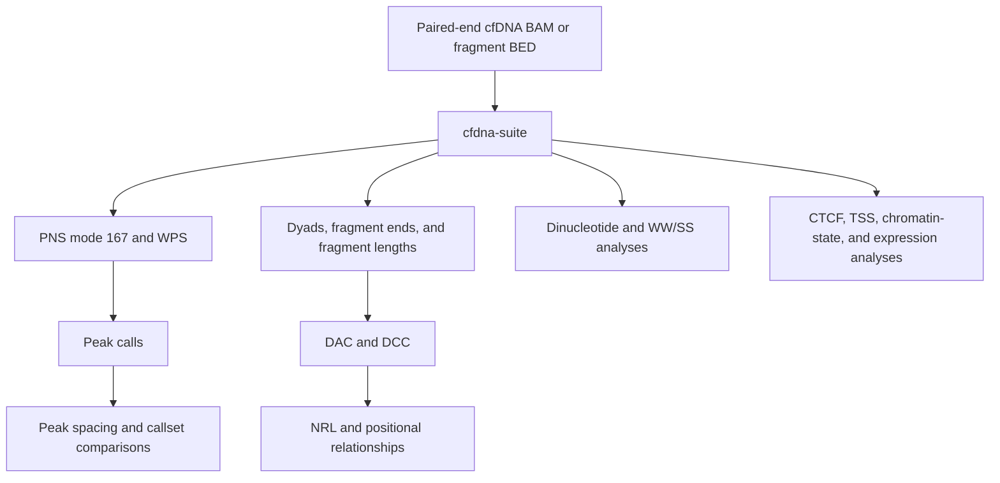

[`cfdna-suite`](commands/cfdna-suite.md) applies cfDNA-oriented defaults and uses one filtered fragment set throughout the full analysis tree.

```bash
nucleosuite cfdna-suite \
  --bam sample.bam \
  --fasta hg19.fa \
  --resource-set hg19-gm12878 \
  --contigs chr1-22,chrX \
  --cores 8 \
  --outdir sample_cfdna_suite
```

Use standalone commands for individual analyses or different fragment-selection settings between outputs.

### PNS followed by spacing analysis

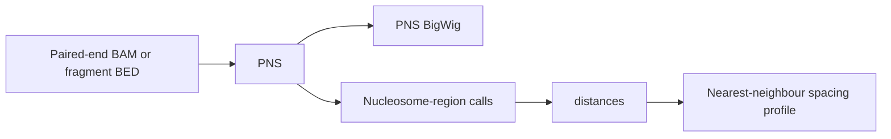

The same workflow can use BNS with `--scoring-method bns` or TNS with `--scoring-method tns`; the nucleosome peak caller is unchanged.

For example:

```bash
nucleosuite pns \
  --bam sample.bam \
  --fasta hg19.fa \
  --out-prefix sample_pns

nucleosuite distances sample_methodpns_mode167_lower137_upper197_smooth0x2_nucleosome_regions.bed \
  --position-column 7 \
  --min-distance 120 \
  --max-distance 250 \
  --output-prefix sample_spacing
```

## MNase-seq: from protected fragments to nucleosome organization

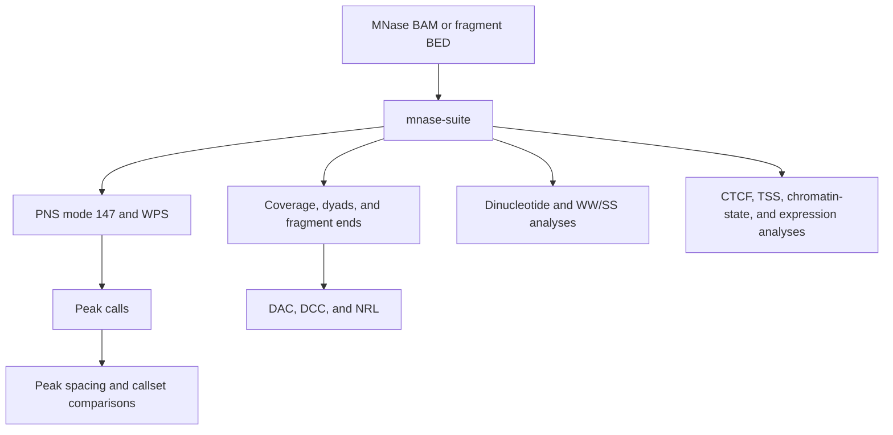

[`mnase-suite`](commands/mnase-suite.md) applies MNase-oriented defaults and uses one retained fragment population across downstream outputs.

```bash
nucleosuite mnase-suite \
  --bam sample.bam \
  --fasta hg19.fa \
  --resource-set hg19-gm12878 \
  --contigs chr1-22,chrX \
  --cores 8 \
  --outdir sample_mnase_suite
```

## Generate several track classes in one pass

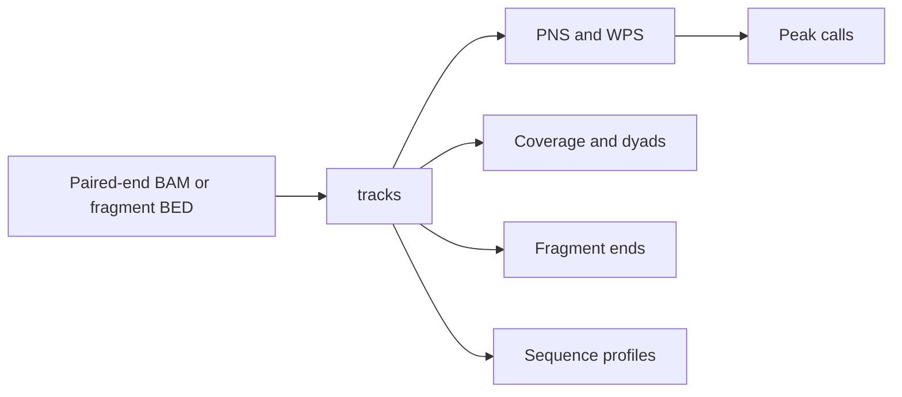

Use [`tracks`](commands/tracks.md) when several outputs should share the same fragment filtering but you do not need the full suite. A fragment is read once per chunk and can contribute to every requested fragment-length range that contains it.

```bash
nucleosuite tracks \
  --bam sample.bam \
  --fasta hg19.fa \
  --output-dir sample_tracks \
  --output-prefix sample \
  --fragment-range "137-197=pns,posPNS,coverage,pns_peaks" \
  --fragment-range "120-180=wps,wps_smoothed,mWPS,sm_mWPS,wps_peaks" \
  --fragment-range "145-147=dyad,fragment_left_ends,fragment_right_ends"
```

## Generate a nucleosome signal and call peaks

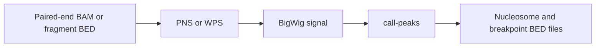

`pns` and `wps` can call peaks during signal generation. [`call-peaks`](commands/call-peaks.md) applies the same callers to an existing compatible BigWig.

```bash
nucleosuite call-peaks \
  --input-bigwig sample_pns.bw \
  --method pns \
  --signal both \
  --out-prefix sample_peaks
```

## Compare nucleosome spacing between chromatin states

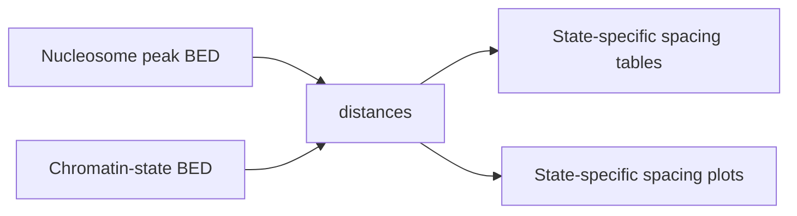

The bundled GM12878 hg19 ChromHMM annotation can be passed directly into the command. `resources path` prints the installed path, and `$(...)` substitutes that path into `--state-bed`.

```bash
nucleosuite distances sample_nucleosome_regions.bed \
  --position-column 7 \
  --state-bed "$(nucleosuite resources path gm12878-hg19-states)" \
  --min-distance 120 \
  --max-distance 250 \
  --output-prefix spacing_by_state
```

[`peak-states`](commands/peak-states.md) counts peaks within each state and measures how state representation changes with peak score.

```bash
nucleosuite peak-states sample_nucleosome_regions.bed \
  --state-bed "$(nucleosuite resources path gm12878-hg19-states)" \
  --output-prefix peak_state_counts
```

## Compare flanking nucleosome spacing across reference-site categories

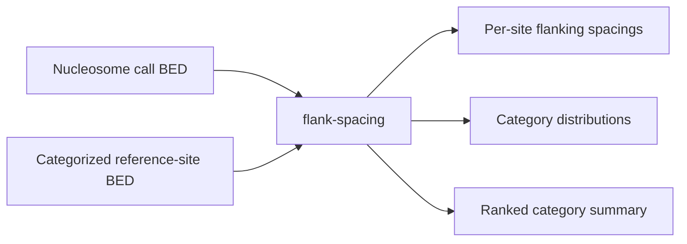

Use [`flank-spacing`](commands/flank-spacing.md) when each reference site belongs to a category and the biological quantity of interest is the distance between the nearest nucleosome strictly upstream and the nearest nucleosome strictly downstream. Categories are read from BED column 4 by default.

```bash
nucleosuite flank-spacing \
  --nucleosome-bed sample_nucleosome_regions.bed \
  --region-bed categorized_sites.bed \
  --category-col 4 \
  --output-prefix categorized_flank_spacing
```

The default figure uses density curves, evaluates each curve at 190 and 260 bp, ranks categories by `y(190) / y(260)` from lowest to highest, highlights the top seven categories, and shows 0-500 bp on the x-axis. Raw count curves are available with `--distribution count`.

## Detect repeating spacing with DAC and estimate NRL

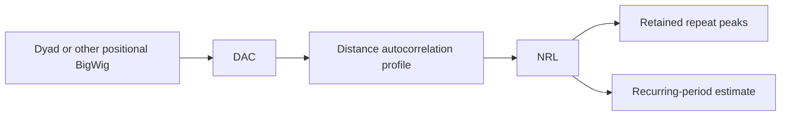

[`dac`](commands/dac.md) measures recurrence of the same signal at each distance. A periodic signal produces DAC peaks at the repeat distance and its multiples. [`nrl`](commands/nrl.md) then fits those repeated maxima to estimate one recurring period.

```bash
nucleosuite dac \
  --bigwig sample_dyad.bw \
  --chrom-sizes sample.bam \
  --scope combined_chromosomes \
  --dmax 2000 \
  --out-prefix sample_dac

nucleosuite nrl sample_dac.tsv \
  --peak-resolution 160 \
  --output-prefix sample_nrl
```

See [Distance autocorrelation](ALGORITHMS.md#distance-autocorrelation) for a worked 185 bp example and figure.

## Compare two positional signals with DCC

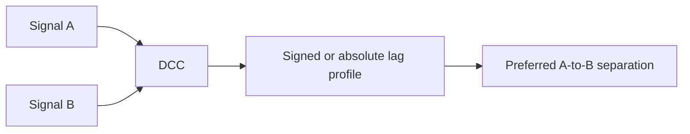

[`dcc`](commands/dcc.md) measures where one signal occurs relative to another.

```bash
nucleosuite dcc bigwig \
  --bigwig-a short_fragment_dyad.bw \
  --bigwig-b long_fragment_dyad.bw \
  --chrom-sizes sample.bam \
  --signed-lags \
  --dmax 500 \
  --out-prefix short_vs_long
```

Positive signed lag places signal B downstream of signal A in the active coordinate orientation.

## Examine signal around CTCF sites or other annotations

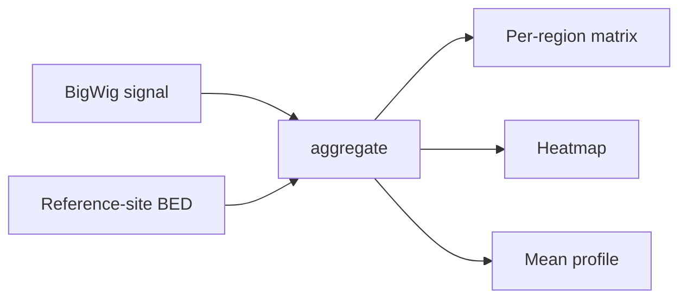

Use [`aggregate`](commands/aggregate.md) when you want a heatmap plus the average signal around many sites. The bundled GM12878 CTCF sites can be inserted directly:

```bash
nucleosuite aggregate \
  --bigwig sample_pns.bw \
  --region-bed "$(nucleosuite resources path gm12878-hg19-ctcf)" \
  --strand-col 6 \
  --window-half 2500 \
  --output-dir sample_ctcf_aggregate \
  --output-prefix sample_ctcf
```

[`region-extract`](commands/region-extract.md) exports every region's signal vector and nearby peak records.

## Compare one main peak callset with multiple callsets

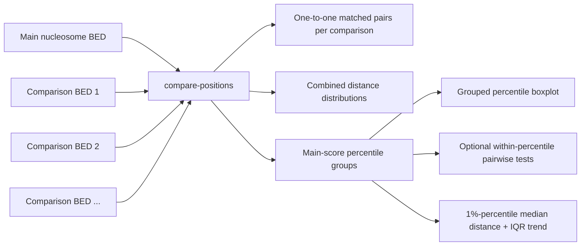

[`compare-positions`](commands/compare-positions.md) compares one main nucleosome BED with one or more comparison BEDs using one-to-one matching. Matched pairs are grouped by the main BED score, with quartiles used by default. `--stats` performs pairwise tests separately within each percentile group. Main and comparison labels can be supplied as `LABEL=path.bed`.

## Analyse fragment sequence periodicity

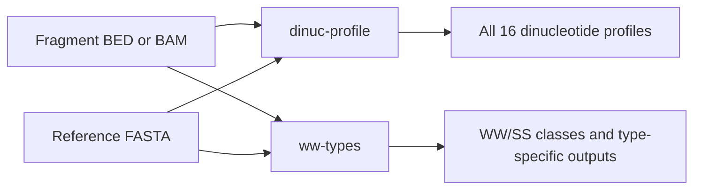

Use [`dinuc-profile`](commands/dinuc-profile.md) to measure where each dinucleotide occurs relative to the fragment centre. Use [`ww-types`](commands/ww-types.md) when you want to classify fragments by the WW/SS pattern in the centred 147-bp reference core and generate type-specific outputs.

## Compare fragment-length profiles across chromatin states

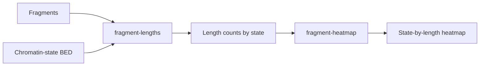

Count fragment lengths within the bundled state annotation:

```bash
nucleosuite fragment-lengths \
  --bam sample.bam \
  --bed "$(nucleosuite resources path gm12878-hg19-states)" \
  --bed-label-column 4 \
  --output sample_state_lengths.tsv
```

Then use [`fragment-heatmap`](commands/fragment-heatmap.md) to compare the resulting state-specific profiles. Row-percentage normalization shows the fragment-length distribution within each state; fragment-length z-scores highlight states that are relatively enriched or depleted for each length.

## Gene-centred analysis with bundled resources

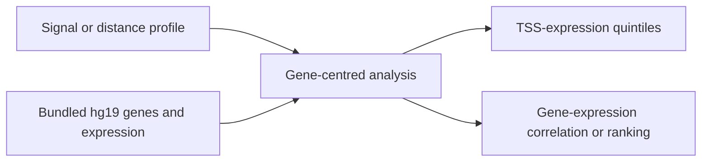

The bundled hg19 gene BED and HPA tissue-expression table can be passed directly into commands:

```bash
GENES="$(nucleosuite resources path hg19-genes)"
EXPR="$(nucleosuite resources path hpa-tissue-expression)"
```

Use [`tss-expression-quintiles`](commands/tss-expression-quintiles.md) to group genes by expression and compare signal around their TSSs. Use [`gene-expression`](commands/gene-expression.md) to relate expression profiles to gene-level spacing or periodicity measures.

## Chromosome-wise execution and combination

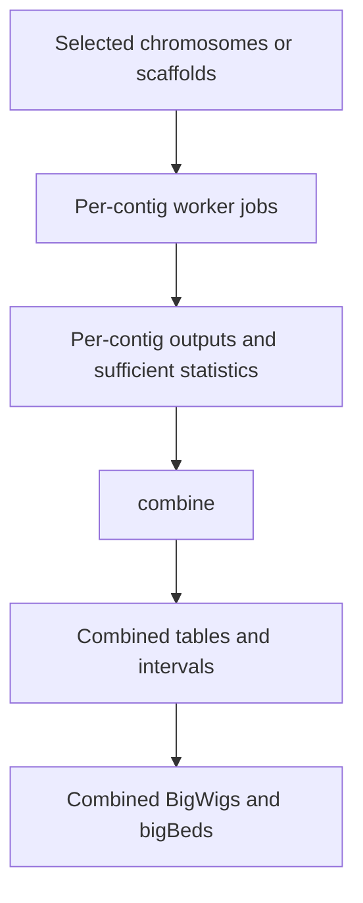

Many commands can split indexed inputs by contig. Per-contig calculations are completed first, then raw counts, products, opportunities, and interval records are combined before derived percentages or normalized values are recalculated.

To defer the combine stage:

```bash
nucleosuite dyads ... --cores 4 --skip-combine
nucleosuite combine --input-dir sample_dyads_multicontig
```

If the per-contig work is already complete, [`combine`](commands/combine.md) can reconstruct the combined outputs without rerunning the analysis itself.

## Randomized controls

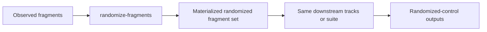

[`randomize-fragments`](commands/randomize-fragments.md) changes fragment coordinates while preserving selected fragment properties and placement constraints. Process observed and randomized fragments with the same downstream settings for a positional null comparison.

The `cfdna-suite` and `mnase-suite` commands also provide randomized-only workflow execution with `--randomize`.
