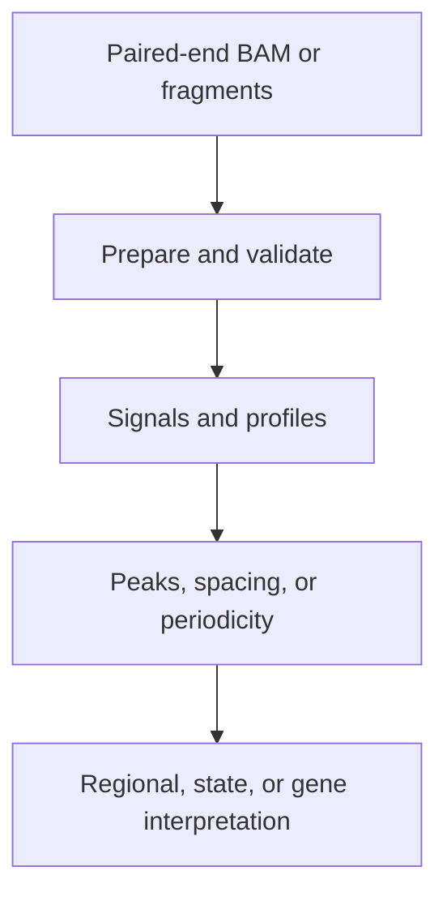
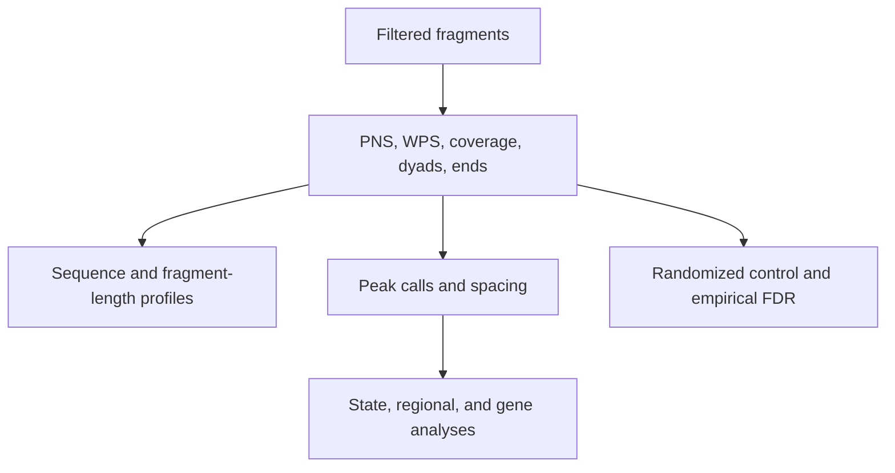

# Workflows

NucleoSuite commands can be used independently or joined into larger analyses. The common pattern is to prepare compatible fragments, create one or more signals, call or filter features, then interpret those features in genomic context.

## General analysis path



Use `fragments` when an explicit fragment interval file is useful. Use `tracks` when several signal families, fragment ranges, or sequence outputs should share one fragment pass. Use `pns` or `wps` when a single positioning signal and its calls are sufficient.

## PNS signal workflow

```bash
nucleosuite pns \
  --bam sample.bam \
  --fasta genome.fa \
  --contigs chr1-22,chrX \
  --cores 8 \
  --out-prefix sample
```

PNS estimates a protected-DNA mode automatically unless an integer `--mode` is supplied. Its positive distribution represents probability in percent: every complete fragment contributes positive mass 100 and negative mass -100. Native PNS BigWig values and PNS peak scores are retained without score scaling. The `posPNS` track is a non-negative reference representation of the same waveform.

Use `call-peaks` to change calling thresholds on an existing PNS BigWig, `filter-peaks` to make a reusable subset, `distances` for peak spacing, and `aggregate` or `region-extract` for signal around reference sites.

## WPS workflow

Use `wps` when a fixed protection-window score is the relevant signal. WPS has its own fragment range, protection window, smoothing, baseline, and peak-calling options. It can be generated alongside PNS in a `tracks` pass when both representations are needed.

## `tracks` as a shared input pass

Specify one or more fragment ranges and output tokens:

```bash
nucleosuite tracks \
  --bam sample.bam \
  --fasta genome.fa \
  --output-dir sample_tracks \
  --fragment-range "137-197=pns,posPNS,coverage,pns_peaks" \
  --fragment-range "120-180=wps,sm_mWPS,wps_peaks" \
  --fragment-range "145-147=dyad,fragment_left_ends,fragment_right_ends" \
  --fragment-range "145-147=dinuc_profile,ww_types,type_dyads"
```

The same filtering and contig selection apply to all requested outputs. `pns_peaks` uses the PNS score for the specified range; `wps_peaks` uses the selected WPS calling signal. A specification file is preferable when a workflow has many ranges or output prefixes.

## cfDNA and MNase-suite workflows

The coordinated suites combine fragment processing, signal generation, sequence composition, peak calls, spacing, regional aggregation, and optional gene analyses. They can create randomized controls and empirical peak FDR products, and retain reports for resumption and plotting.



Use `cfdna-suite` for plasma/cell-free DNA fragmentomics and `mnase-suite` for MNase-seq-oriented length, sequence, dyad, and positioning analyses. The exact options and defaults are listed on their command pages and in their bundled `--help` output.

## CUT&RUN and CUT&Tag workflow

`cutn-suite` is the coordinated matched target/control workflow:

```bash
nucleosuite cutn-suite \
  --treatment1-bam target.bam \
  --control1-bam control.bam \
  --outdir target_cutn_suite \
  --cores 8
```

It estimates or accepts PNS mode, generates mode-centred PNS and broad coverage tracks, calls treatment candidates, measures coverage in each replicate, applies configurable seed/member gates, and forms clusters. PNS score BigWigs stay native. Coverage is normalized separately to mean 100 for Stage 1 measurement.

Provide treatment and control inputs for a second condition to run the Stage 2 interaction comparison in the same command. Alternatively, use `cutn-compare` with two completed Stage 1 manifests. Stage 2 reuses saved tracks and cluster files rather than reopening the BAMs.

## Randomized controls and FDR

For an observed peak set and one or more identically processed randomized peak sets:

```bash
nucleosuite empirical-peak-fdr \
  sample_nucleosome_regions.bed \
  sample_randomized_nucleosome_regions.bed \
  --fdr 0.05
```

The complete observed set receives empirical p-values and FDR. The optional threshold writes a separate filtered set. The cfDNA and MNase suites can orchestrate the randomized analysis with `--with-randomized-control`.

## Spacing and periodicity

Use `distances` on representative peak positions, [`flank-spacing`](commands/flank-spacing.md) for spacing on either side of reference sites, `dac` for recurrence within one signal, `dcc` for offsets between two signals, and `nrl` for a recurring-period estimate from a distance profile. Chromatin-state versions of distance analyses accept a bundled or user-supplied state BED.

## Rerun, combine, and plot

Use `combine` after a chromosome-wise run when combined outputs were skipped or need to be regenerated. Use `plot` to recreate or customize figures from saved TSV outputs. `cutn-suite --rerun-from` reuses compatible per-replicate tracks to change downstream gates, clustering, Stage 2, or aggregate settings without rebuilding the initial PNS and coverage tracks.
