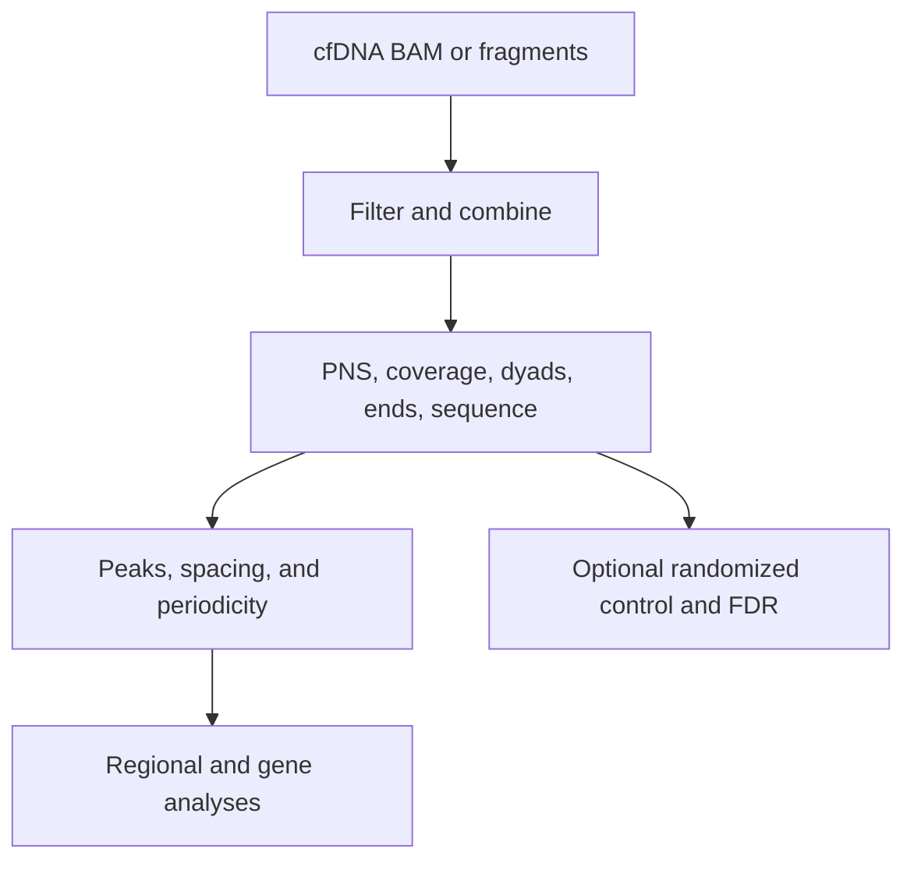

# `nucleosuite cfdna-suite`

## What this command does

`cfdna-suite` coordinates cfDNA fragment preparation, PNS and coordinate tracks, sequence profiles, peak calls, spacing, periodicity, regional aggregation, and optional gene analyses. With multiple contigs, it processes and combines chromosome-wise outputs before running combined downstream analyses.

## Why use it

Use it for a reproducible cfDNA analysis that carries one set of filtering, fragment ranges, and output conventions through signal generation and downstream interpretation.

## Basic usage

```bash
nucleosuite cfdna-suite \
  --bam sample.bam \
  --fasta hg19.fa \
  --resource-set hg19-gm12878 \
  --contigs chr1-22,chrX \
  --cores 8 \
  --outdir sample_cfdna_suite
```

Use standalone commands when only one signal or analysis is needed, or when separate analyses require different filtering.

## Main defaults

| Setting | cfDNA default |
|---|---|
| PNS fragment range | 137–197 bp; mode 167 bp |
| Exact dyads and fragment ends | 145, 161, 167 bp |
| Ranged dyads/ends, DAC, and WW/SS | 144–146, 160–162, 166–168 bp |
| PNS peak distances | order 1 to 500 bp; orders 1–7 to 1500 bp |
| Long DAC-derived NRL | 1–1500 bp, resolution 160; first called peak excluded from regression |
| Short periodicity | 1–144 bp, resolution 1 |

## Workflow



The PNS track uses the fixed length-adaptive kernel described in [Algorithms](../ALGORITHMS.md). Its positive distribution is represented in percent, with positive mass 100 and negative mass -100 per complete fragment. Raw PNS and `posPNS` BigWigs and PNS peak scores are retained without score scaling. Coverage is the only signal normalized by the suite, and that normalization is a separate mean-100 product used where coverage comparisons require it.

## Downstream analyses

The suite can produce PNS peak calls, breakpoint calls, ChromHMM-stratified spacing, CTCF/TSS aggregation, TSS expression quintiles, region extraction, fragment-length profiles and heatmaps, optional PNS gene-expression analysis, positive runs, peak-score distributions, dinucleotide profiles, WW/SS classifications, and type-specific dyads. Exact resources and feature toggles are listed by `nucleosuite cfdna-suite --help-all`.

`--randomize` runs a randomized-only analysis. `--with-randomized-control` runs observed and randomized workflows with identical settings and appends empirical p-value/FDR columns to observed combined peak BEDs. Add `--fdr 0.05` for separate filtered BEDs.

`--resource-set hg19-gm12878` supplies compatible bundled annotations. `--resume`, `--force`, and `--dry-run` control recovery and planning.

See [Output layout](../OUTPUT_LAYOUT.md), [Workflows](../WORKFLOWS.md), and the command-line help for all options.

[Back to the command reference](../COMMAND_REFERENCE.md)
