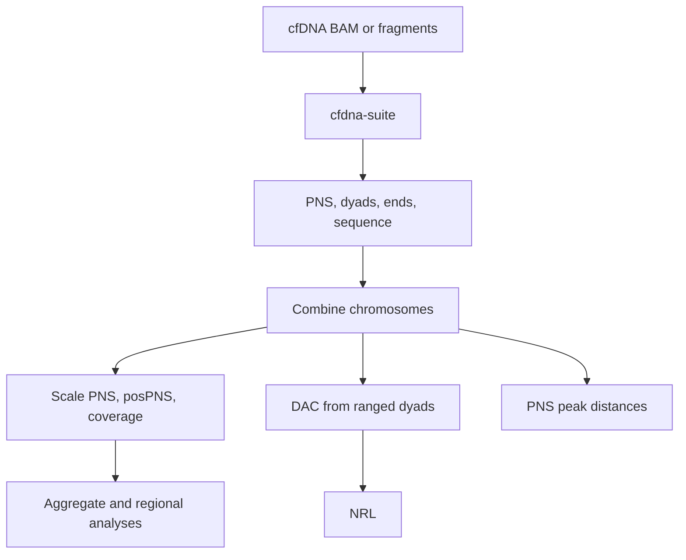

# `nucleosuite cfdna-suite`

## What this command does

`cfdna-suite` runs the coordinated cfDNA NucleoSuite workflow. With multiple contigs, tracks are produced per contig, combined, and then the normalization and downstream analyses are run once on the combined data.

## Why use it

Use the suite when the cfDNA track, sequence, spacing, periodicity and regional analyses should share the same fragment filtering, resources, provenance, combination step and post-combine normalization. Use standalone commands when only one analysis is needed or when different filters are required between analyses.

## Typical run

```bash
nucleosuite cfdna-suite \
  --bam sample.bam \
  --fasta hg19.fa \
  --resource-set hg19-gm12878 \
  --contigs chr1-22,chrX \
  --cores 8 \
  --outdir sample_cfdna_suite
```

## Workflow



## Main defaults

| Setting | cfDNA default |
|---|---|
| PNS | 137–197 bp fragments; mode 167 bp |
| Exact dyads and fragment ends | 145, 161, 167 bp |
| Ranged dyads/ends, DAC and WW/SS | 144–146, 160–162, 166–168 bp |
| PNS nucleosome distances | order 1 to 500 bp; orders 1–7 to 1500 bp |
| Long DAC-derived NRL | 1–1500 bp, resolution 160; first called peak excluded from regression |
| Short periodicity | 1–144 bp, resolution 1 |
| Intermediate periodicity | 147–220, 163–220, 169–220 bp respectively; resolution 8 |

WPS and DCC remain available as standalone NucleoSuite commands but are **not run by `cfdna-suite`**.

## Post-combine normalization

The suite preserves the raw combined PNS, posPNS and coverage tracks, then creates normalized tracks only after chromosome combination:

- coverage is mean-scaled to 100;
- posPNS is mean-scaled to 100;
- PNS is scaled to 100 using the mean column-5 score of the combined PNS nucleosome calls as its reference mean.

PNS aggregate analyses (including CTCF, TSS and tissue-expression-quintile aggregation) use this scaled PNS track. Regional extraction uses scaled PNS and scaled coverage.

## DAC and NRL

DAC is calculated from each ranged dyad track. Each DAC profile feeds three `nrl` analyses:

1. 1–1500 bp, resolution 160, with `--skip-first-peaks 1`;
2. 1–144 bp, resolution 1;
3. an intermediate window at resolution 8, starting one base above the upper fragment bound: 147, 163, or 169 bp and ending at 220 bp.

The skipped first long-range peak remains called and labelled in the NRL profile but is not used by the regression; regression numbering therefore begins with Peak 2.

## Peak spacing

The combined PNS nucleosome calls receive two distance analyses:

- adjacent/order-1 spacing from 1–500 bp;
- orders 1–7 from 1–1500 bp with combined regression to estimate NRL.

## Other retained downstream analyses

The suite retains PNS peak calls, ChromHMM-stratified PNS spacing, CTCF/TSS aggregation, TSS expression quintiles, region extraction, fragment-length profiles and heatmaps, optional PNS gene-expression analysis, PNS positive runs, PNS peak-score-frequency analyses, dinucleotide profiles, WW/SS classification and WW/SS type-specific dyads.

`peak-score-frequency` automatically displays BED/BED.gz scores on a ×1000 scale; bigBed scores are already on the 0–1000 scale and are not multiplied again.

## Randomization, resources and resume

`--randomize` creates one validated randomized fragment set and runs it through the same current suite tree. `--resource-set hg19-gm12878` supplies compatible bundled annotations. `--resume`, `--force`, and `--dry-run` control recovery and planning.

See [Output layout](../OUTPUT_LAYOUT.md), [Workflows](../WORKFLOWS.md), and the command-line help for the full accepted option set.

[Back to the command reference](../COMMAND_REFERENCE.md)
