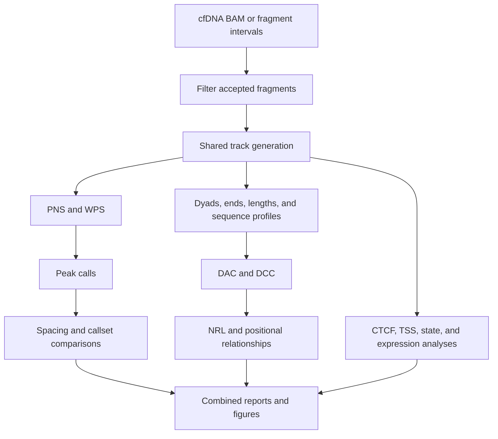

# `nucleosuite cfdna-suite`

## What this command does

`cfdna-suite` runs a coordinated cfDNA fragmentomics workflow. One filtered fragment population feeds the signal, sequence, spacing, periodicity, regional, and optional expression stages shown below.

Observed-data analysis is the default.

## Why use the suite

Use the suite when all stages should share fragment filters, resources, provenance, and a resumable output tree. Use standalone commands for an individual analysis or different filters between outputs.

## Typical run

```bash
nucleosuite cfdna-suite \
  --bam sample.bam \
  --fasta hg19.fa \
  --resource-set hg19-gm12878 \
  --contigs chr1-22,chrX \
  --cores 8 \
  --outdir sample_cfdna_suite
```

`--resource-set hg19-gm12878` supplies the compatible bundled genes, GM12878 states, CTCF sites, blacklist, expression resources, and gene-set rules used by the resource-dependent steps.

## What the workflow does



Shared intermediate products prevent repeated fragment reading and classification.

## Scientific defaults

| Setting | cfDNA default |
|---|---|
| PNS | 137–197 bp fragments; mode 167 bp |
| WPS | 120–180 bp fragments; 120 bp protection window |
| WPS adjustment | 21 bp, order-2 Savitzky–Golay smoothing; 1,000 bp raw-WPS median baseline |
| Exact dyad/sequence lengths | 145, 161, and 167 bp |
| Ranged classes | 145–147, 160–162, and 166–168 bp |
| Identical-fragment limit | 1 |
| Even-length dyads | 0.5 on each central base |
| Interval format | BED and bigBed |
| Expression value | nTPM |

PNS peak text BED scores remain six-decimal floats. PNS bigBed scores use `--bigbed-score-scale 1000` by default before integer conversion/clamping.

## Bundled resources

`--resource-set hg19-gm12878` supplies the hg19/GM12878 annotations used by resource-dependent stages. See [`resources`](resources.md#what-is-in-the-hg19gm12878-set) for their contents, biological context, and sources. Use `nucleosuite resources path NAME` to inspect a file.

## Randomized-control mode

```bash
nucleosuite cfdna-suite ... \
  --randomize \
  --outdir sample_cfdna_randomized
```

`--randomize` creates and validates one randomized fragment set, then runs that control through the analysis tree. The run contains randomized-control outputs only.

Randomized fragments retain chromosome and fragment length, cannot remain at their original coordinates, and cannot overlap the effective blacklist. Randomized filenames contain `_randomized_control`.

## Blacklist behaviour

The bundled hg19 blacklist v2 is enabled when the reference lengths match hg19/GRCh37 exactly. `--blacklist-bed FILE` selects another blacklist; `--no-blacklist` disables filtering.

Complete overlapping fragments and interval records are removed. In signal-based analyses, blacklisted bases remain missing rather than being converted to biological zero signal.

## Parallel execution

`--cores` controls normal per-contig work and memory-light concurrent steps.

Two memory-sensitive limits default to **1**:

- `--indexed-combine-cores` for concurrent BigWig/bigBed writers;
- `--memory-intensive-analysis-cores` for whole-callset analyses.

Increase these values only when sufficient memory is available.

## Resume and recovery

Use:

```text
--resume    reuse completed steps when their effective parameters and inputs still match
--force     rerun completed steps
--dry-run   validate inputs and print the planned workflow without executing it
```

Track files use `.partial` names until complete. Per-contig checkpoints and manifests determine which outputs `--resume` can reuse.

## Long-range NRL resolution

`--nrl-peak-resolution` defaults to 160 bp. This gives 51 bp smoothing for broad NRL peak detection and 21 bp smoothing for final local-maximum placement. The separate short-range periodicity summaries use no resolution-based smoothing.

## What it writes

The suite uses numbered directories so related stages are easy to locate. See [Output layout](../OUTPUT_LAYOUT.md) for the full tree and the meaning of `per_contig/`, `combined/`, logs, manifests, and completion reports.

## Plot customization

Shared plotting options supplied to the suite are forwarded to plot-producing downstream commands. See [Plot customization](../PLOTTING.md).

See [Workflows](../WORKFLOWS.md) for examples showing how this command connects to downstream analyses.

[Back to the command reference](../COMMAND_REFERENCE.md)
