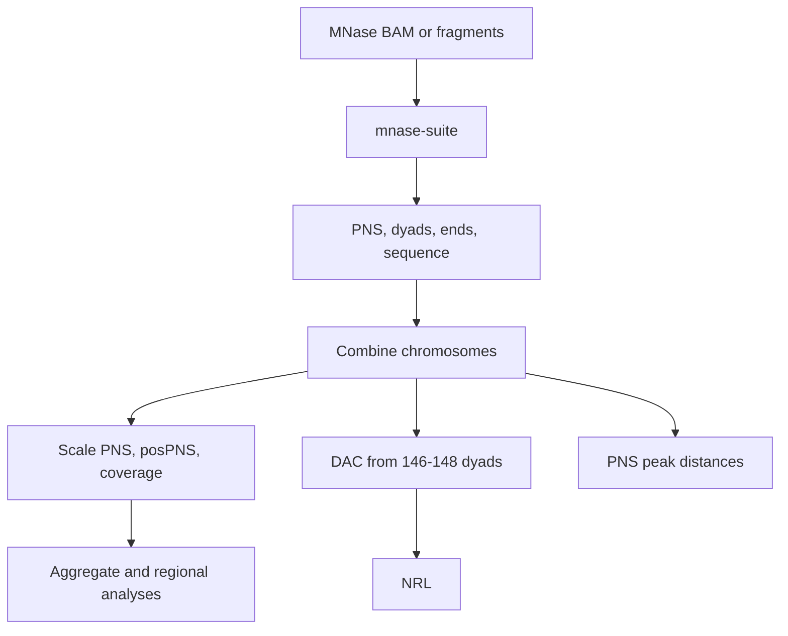

# `nucleosuite mnase-suite`

## What this command does

`mnase-suite` runs the coordinated MNase-seq NucleoSuite workflow. With multiple contigs, tracks are produced per contig, combined, and normalization/downstream analyses are then performed once on the combined data.

## Why use it

Use the suite when the MNase track, sequence, spacing, periodicity and regional analyses should share the same fragment filtering, resources, provenance, combination step and post-combine normalization. Use standalone commands when only one analysis is needed or when different filters are required between analyses.

## Typical run

```bash
nucleosuite mnase-suite \
  --bam "merged_chr*.bam" \
  --fasta hg19.fa \
  --resource-set hg19-gm12878 \
  --contigs chr1-22,chrX \
  --cores 8 \
  --outdir sample_mnase_suite
```

## Workflow



## Main defaults

| Setting | MNase default |
|---|---|
| PNS | 120–180 bp fragments; mode 147 bp |
| Ranged dyads/ends, DAC and WW/SS | 146–148 bp |
| Exact dyad and fragment ends | 147 bp |
| Exact dinucleotide profiles | 145 and 147 bp |
| PNS nucleosome distances | order 1 to 500 bp; orders 1–7 to 1500 bp |
| Long DAC-derived NRL | 1–1500 bp, resolution 160; first called peak excluded from regression |
| Short periodicity | 1–144 bp, resolution 1 |
| Intermediate periodicity | 150–220 bp, resolution 8 |

WPS and DCC remain available as standalone NucleoSuite commands but are **not run by `mnase-suite`**.

## Post-combine normalization

The raw combined PNS, posPNS and coverage BigWigs are retained. After combination the suite additionally creates:

- coverage mean-scaled to 100;
- posPNS mean-scaled to 100;
- PNS scaled to 100 relative to the mean column-5 score of the combined PNS nucleosome calls.

PNS aggregate analyses use the scaled PNS track. Regional extraction uses scaled PNS and scaled coverage.

## DAC, NRL and spacing

DAC is calculated only from the ranged 146–148 bp dyad track. Its DAC outputs feed:

1. NRL at 1–1500 bp, resolution 160, with the first called peak retained in the profile but omitted from regression;
2. short periodicity at 1–144 bp, resolution 1;
3. nucleosome-scale periodicity at 150–220 bp, resolution 8.

The combined PNS nucleosome calls are analysed separately for adjacent spacing (order 1, 1–500 bp) and for orders 1–7 (1–1500 bp), with the latter performing combined NRL regression.

## Other retained downstream analyses

The suite retains PNS peak calls, ChromHMM-stratified PNS spacing, CTCF/TSS aggregation, TSS expression quintiles, region extraction, fragment-length profiles and heatmaps, optional PNS gene-expression analysis, PNS positive runs, PNS peak-score-frequency analyses, dinucleotide profiles, WW/SS classification and WW/SS type-specific dyads.

`peak-score-frequency` automatically displays BED/BED.gz scores on a ×1000 scale; bigBed scores are already on the 0–1000 scale and are not multiplied again.

See [Output layout](../OUTPUT_LAYOUT.md), [Workflows](../WORKFLOWS.md), and the command-line help for the complete accepted option set.

[Back to the command reference](../COMMAND_REFERENCE.md)
