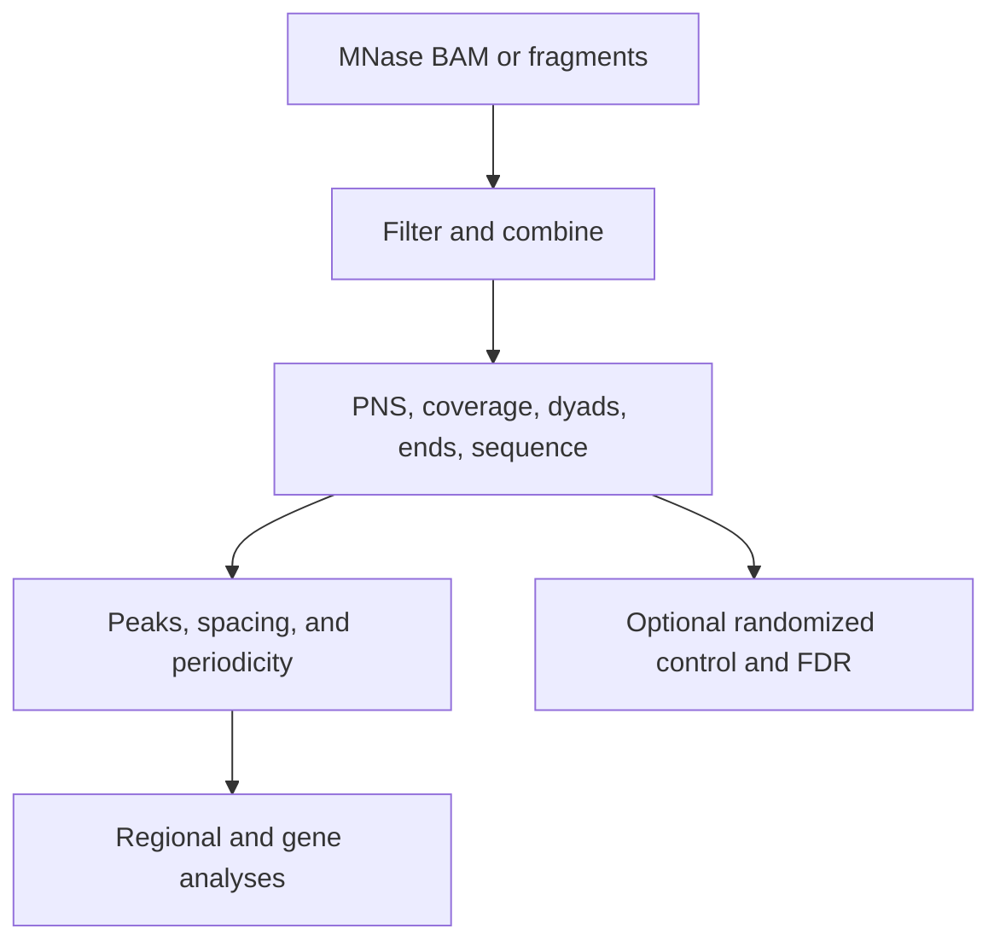

# `nucleosuite mnase-suite`

## What this command does

`mnase-suite` coordinates MNase-seq fragment processing, PNS and coordinate tracks, sequence composition, peak calls, spacing, periodicity, regional aggregation, and optional gene analyses. With multiple contigs, it combines chromosome-wise outputs before running combined downstream analyses.

## Why use it

Use it for an end-to-end MNase-seq workflow when fragment-length, sequence, dyad, positioning, and genomic-context outputs should share one run configuration.

## Basic usage

```bash
nucleosuite mnase-suite \
  --bam "merged_chr*.bam" \
  --fasta hg19.fa \
  --resource-set hg19-gm12878 \
  --contigs chr1-22,chrX \
  --cores 8 \
  --outdir sample_mnase_suite
```

## Main defaults

| Setting | MNase default |
|---|---|
| PNS fragment range | 120–180 bp; mode 147 bp |
| Ranged dyads/ends, DAC, and WW/SS | 146–148 bp |
| Exact dyad and fragment ends | 147 bp |
| Exact dinucleotide profiles | 145 and 147 bp |
| PNS peak distances | order 1 to 500 bp; orders 1–7 to 1500 bp |
| Long DAC-derived NRL | 1–1500 bp, resolution 160; first called peak excluded from regression |
| Short periodicity | 1–144 bp, resolution 1 |
| MNase-scale periodicity | 150–220 bp, resolution 8 |

## Workflow



The PNS track uses the fixed length-adaptive kernel described in [Algorithms](../ALGORITHMS.md). Its positive distribution is represented in percent, with positive mass 100 and negative mass -100 per complete fragment. Raw PNS and `posPNS` BigWigs and PNS peak scores are retained without score scaling. Coverage normalization is separate and is used only for coverage-based comparisons.

## Downstream analyses

The suite can produce PNS peak calls, breakpoint calls, ChromHMM-stratified spacing, CTCF/TSS aggregation, TSS expression quintiles, region extraction, fragment-length profiles and heatmaps, optional PNS gene-expression analysis, positive runs, peak-score distributions, dinucleotide profiles, WW/SS classifications, and type-specific dyads. Exact resources and feature toggles are listed by `nucleosuite mnase-suite --help-all`.

`--randomize` runs a randomized-only analysis. `--with-randomized-control` runs observed and randomized workflows with identical settings and appends empirical p-value/FDR columns to observed combined peak BEDs. Add `--fdr 0.05` for separate filtered BEDs.

See [Output layout](../OUTPUT_LAYOUT.md), [Workflows](../WORKFLOWS.md), and the command-line help for all options.

[Back to the command reference](../COMMAND_REFERENCE.md)
