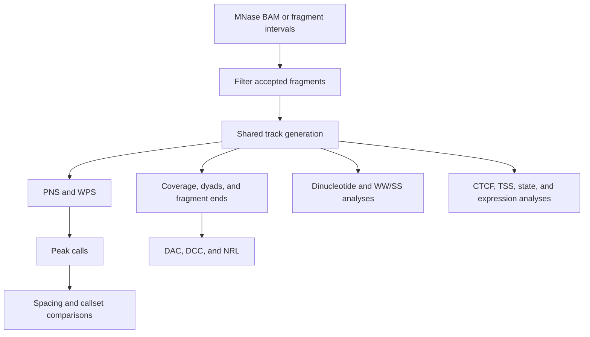

# `nucleosuite mnase-suite`

## What this command does

`mnase-suite` runs a coordinated MNase-seq nucleosome workflow from paired-end BAMs or fragment intervals. One filtered fragment population feeds the signal, sequence, spacing, periodicity, regional, and optional expression stages shown below.

Observed-data analysis is the default.

## Why use the suite

Use `mnase-suite` when all stages should share fragment filters, resources, provenance, and a resumable output tree. Use standalone commands for an individual analysis or different filters between outputs.

## Typical run

```bash
nucleosuite mnase-suite \
  --bam "merged_chr*.bam" \
  --fasta hg19.fa \
  --resource-set hg19-gm12878 \
  --contigs chr1-22,chrX \
  --cores 8 \
  --outdir sample_mnase_suite
```

If complete fragment intervals already exist, use `--fragments FILE [MORE ...]` instead of `--bam`.

## What the workflow does



The shared track pass reads each accepted fragment once per chunk and reuses its fragment and sequence information.

## Scientific defaults

| Setting | MNase default |
|---|---|
| PNS | 120–180 bp fragments; mode 147 bp |
| WPS | 120–180 bp fragments; 120 bp protection window |
| WPS adjustment | 21 bp, order-2 Savitzky–Golay smoothing; 1,000 bp raw-WPS median baseline |
| Fine dyad/sequence range | 145–147 bp |
| Exact dyad lengths | 145 and 147 bp |
| Identical-fragment limit | 1 |
| Even-length dyads | 0.5 on each central base |
| Interval format | BED and bigBed |
| Expression value | nTPM |

PNS text BED scores remain six-decimal floating values. PNS bigBed scores use `--bigbed-score-scale 1000` by default before integer conversion/clamping.

## Bundled resources

`--resource-set hg19-gm12878` supplies the hg19/GM12878 annotations used by resource-dependent stages. See [`resources`](resources.md#what-is-in-the-hg19gm12878-set) for their contents, biological context, and sources. Use `nucleosuite resources path NAME` to inspect a file.

## Randomized-control mode

```bash
nucleosuite mnase-suite ... \
  --randomize \
  --outdir sample_mnase_randomized
```

The suite first creates and validates a randomized fragment set, then runs that control through the same complete workflow. Randomized fragments retain chromosome and length, cannot remain at their original coordinates, and cannot overlap the effective blacklist.

`--randomize-fallback uniform|skip` controls what happens when dinucleotide-matched placement is unavailable.

## Blacklist behaviour

The bundled hg19 blacklist v2 is enabled for exact hg19/GRCh37 reference lengths. `--blacklist-bed FILE` selects another blacklist; `--no-blacklist` disables filtering.

Complete fragments and called intervals overlapping the blacklist are excluded. Blacklisted positions inside retained signal windows remain missing.

## Parallel execution

`--cores` controls normal per-contig and memory-light concurrency.

Memory-sensitive work has separate defaults:

- `--indexed-combine-cores 1` for concurrent BigWig/bigBed writers;
- `--memory-intensive-analysis-cores 1` for whole-callset analyses.

Increase these values only when sufficient memory is available.

## Resume and recovery

```text
--resume    reuse matching completed steps
--force     rerun completed steps
--dry-run   validate and print the planned workflow
```

Outputs use `.partial` names until verified. Checkpoints record the inputs, parameters, and completed outputs that `--resume` can reuse.

## Long-range NRL resolution

`--nrl-peak-resolution` defaults to 160 bp. This gives 51 bp smoothing for broad NRL peak detection and 21 bp smoothing for final local-maximum placement. The separate short-range periodicity summaries use no resolution-based smoothing.

## What it writes

See [Output layout](../OUTPUT_LAYOUT.md) for the numbered suite directories, per-contig/combined trees, manifests, logs, and completion markers.

## Plot customization

Shared plot options supplied to `mnase-suite` are forwarded to downstream plot-producing commands. See [Plot customization](../PLOTTING.md).

See [Workflows](../WORKFLOWS.md) for examples showing how this command connects to downstream analyses.

[Back to the command reference](../COMMAND_REFERENCE.md)
