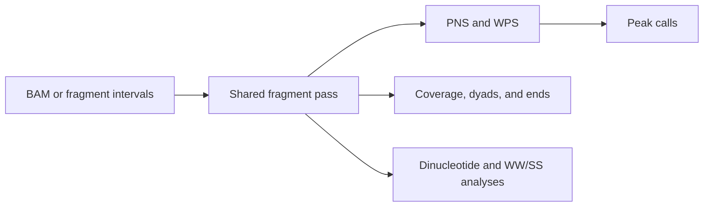

# `nucleosuite tracks`

## What this command does

`tracks` generates multiple fragment-derived outputs in one pass through a BAM or fragment file. Each requested fragment-length range specifies the signals, profiles, or calls to produce.

## Why use it

Use `tracks` when several outputs must share the same fragment filters. It avoids rereading the input for each track. Available output groups cover PNS and WPS scoring, shared peak calls, coverage/dyad/end tracks, and sequence-based profiles.



Sequence-dependent outputs require `--fasta`.

## Define fragment-length ranges

Use one `--fragment-range RANGE=TRACKS` for each output group.

An exact length:

```text
145=dyad,dinuc_profile
```

An inclusive range:

```text
137-197=pns,posPNS,coverage,pns_peaks
```

A fragment can contribute to every requested range that contains its length.

Example:

```bash
nucleosuite tracks \
  --bam sample.bam \
  --fasta genome.fa \
  --output-dir tracks \
  --output-prefix sample \
  --fragment-range "137-197=pns,posPNS,coverage,pns_peaks" \
  --fragment-range "120-180=wps,wps_smoothed,mWPS,sm_mWPS,wps_peaks" \
  --fragment-range "145-147=dyad,fragment_left_ends,fragment_right_ends" \
  --fragment-range "145=dyad,dinuc_profile" \
  --fragment-range "145-147=ww_types,type_dyads"
```

A 145 bp fragment contributes to every compatible range above.

### PNS range example

Request PNS track names for each scoring range. The protected-DNA mode is shared across the requested ranges:

```bash
nucleosuite tracks \
  --bam sample.bam \
  --score-mode-length 167 \
  --fragment-range "137-197=pns,posPNS,pns_peaks" \
  --output-dir sample_tracks
```

`pns_peaks` calls peaks from `pns`, or `pns_smoothed` when score smoothing is enabled. The token can be requested with or without writing the corresponding score BigWig.

## Use a specification file for larger workflows

A tab-separated spec file is easier to maintain when many ranges or exact output prefixes are needed:

```text
fragment_range  output_prefix                                  tracks                                      basic_scope
137-197         results/sample_PNS_methodpns_mode167_lower137_upper197_smooth0x2   pns,posPNS,coverage,pns_peaks              range
120-180         results/sample_WPS_prot120_lower120_upper180_baseline1000_sg21x2_callerwps   coverage,wps,wps_smoothed,mWPS,sm_mWPS    range
145             results/sample_145_dyads_lower145_upper145     dyad                                        range
```

`basic_scope=range` uses the stated fragment range for coverage, dyads, and ends. `basic_scope=all` uses every accepted fragment for those basic tracks; the selected nucleosome score and WPS continue to use their stated ranges.

## Nucleosome-score peak calls

`pns_peaks` invokes the PNS positive-region caller. Text BED scores remain six-decimal floating-point values after `--score-peak-score-scale` (default 1).

`--bigbed-score-scale` defaults to 1 and controls integer rounding/clamping for the bigBed score field. BigWigs retain native PNS and `posPNS` values.

## Duplicate limits versus sparse-coordinate limits

These control different things:

- `--max-duplicates 1` limits identical complete fragments `(contig,start,end)`;
- `--max-per-coordinate 0` leaves final dyad/end pile-ups uncapped.

A positive `--max-per-coordinate` affects only the sparse output coordinate after fragments have been accumulated.

## Randomized controls

Create the randomized fragment set first, then run `tracks` on that materialized control with the same track specification:

```bash
nucleosuite randomize-fragments \
  --bam sample.bam \
  --fasta genome.fa \
  --method dinucleotide \
  --seed 12345 \
  --output-prefix sample_randomized

nucleosuite tracks \
  --fragments sample_randomized.randomized.fragments.bed.gz \
  --fasta genome.fa \
  --spec-file randomized_tracks.tsv \
  --max-duplicates 0
```

All tracks in this run then use the same randomized coordinates.

## Multicontig use

```bash
nucleosuite tracks \
  --bam sample.bam \
  --fasta genome.fa \
  --chrom-sizes sample.bam \
  --contigs chr1-22,chrX \
  --cores 8 \
  --output-dir sample_tracks \
  --fragment-range "137-197=pns,posPNS,coverage,pns_peaks" \
  --fragment-range "120-180=wps,sm_mWPS,wps_peaks"
```

Indexed inputs can be processed by contig in parallel. Plain unindexed BED/TSV fragment inputs run serially.

Use `--skip-combine` when you want to stop after per-contig outputs and run `nucleosuite combine` later.

## Completion report

`--report PATH` is written after all requested outputs complete. It records the track specification and fragment limits used by the run. The suites use it when resuming work.

## Plot customization

Sequence-profile and fragment-summary figures use the shared options in [Plot customization](../PLOTTING.md).

See [Workflows](../WORKFLOWS.md) for examples showing how this command connects to downstream analyses.

[Back to the command reference](../COMMAND_REFERENCE.md)
