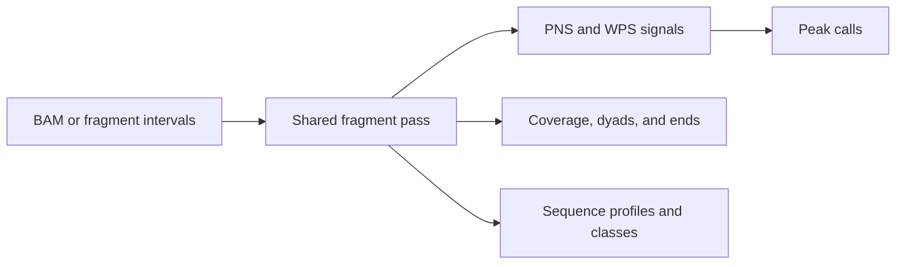

# `nucleosuite tracks`

## What this command does

`tracks` generates several fragment-derived outputs in one pass through a BAM or fragment file. Each requested fragment-length range specifies the signals, profiles, or calls to produce, so related outputs share the same filtering, deduplication, blacklist, and contig settings.

Available output families include PNS and WPS signals, shared peak calls, coverage, dyads, fragment ends, dinucleotide profiles, and WW/SS sequence classifications. Sequence-dependent outputs require `--fasta`.

## Why use it

Use `tracks` to make related signal families or fragment-length ranges in one coordinated pass, keeping filters, blacklist handling, and output metadata aligned.



## Define fragment-length ranges

Use one `--fragment-range RANGE=TRACKS` for each output group. An exact length is written as `145=dyad,dinuc_profile`; an inclusive range is written as `137-197=pns,posPNS,coverage,pns_peaks`.

A fragment contributes to every requested range that contains its length:

```bash
nucleosuite tracks \
  --bam sample.bam \
  --fasta genome.fa \
  --output-dir tracks \
  --output-prefix sample \
  --fragment-range "137-197=pns,posPNS,coverage,pns_peaks" \
  --fragment-range "120-180=wps,wps_smoothed,mWPS,sm_mWPS,wps_peaks" \
  --fragment-range "145-147=dyad,fragment_left_ends,fragment_right_ends" \
  --fragment-range "145=dyad,dinuc_profile" \
  --fragment-range "145-147=ww_types,type_dyads"
```

`pns_peaks` calls the PNS positive-region caller on the PNS signal for that range. With score smoothing enabled it uses the smoothed score for the call while still allowing the raw score to be written.

## Specification files

A tab-separated specification is useful for larger workflows or exact output prefixes:

```text
fragment_range  output_prefix                                  tracks                                      basic_scope
137-197         results/sample_pns_mode167_lower137_upper197   pns,posPNS,coverage,pns_peaks              range
120-180         results/sample_wps_prot120                     coverage,wps,wps_smoothed,mWPS,sm_mWPS    range
145             results/sample_145_dyads                        dyad                                        range
```

`basic_scope=range` uses the stated range for coverage, dyads, and ends. `basic_scope=all` uses every accepted fragment for those basic tracks; PNS and WPS continue to use their stated ranges.

## PNS values and peak scores

PNS uses the fixed length-adaptive probabilistic kernel described in [Algorithms](../ALGORITHMS.md). Its positive distribution represents probability in percent, with positive mass 100 and negative mass -100 for each complete fragment. PNS BigWig values are written natively; `tracks` does not apply score normalization.

Text BED scores remain six-decimal floating-point values after `--score-peak-score-scale`. `--bigbed-score-scale` converts them to the integer bigBed score field and defaults to `1` for PNS, so no additional score rescaling is applied unless explicitly requested.

## Duplicate and coordinate limits

- `--max-duplicates 1` limits identical complete fragments `(contig,start,end)`.
- `--max-per-coordinate 0` leaves final dyad/end pile-ups uncapped.

A positive `--max-per-coordinate` affects only sparse output coordinates after fragments have been accumulated.

## Randomized controls

Create a randomized fragment set first, then run `tracks` with the same specification:

```bash
nucleosuite randomize-fragments \
  --bam sample.bam \
  --fasta genome.fa \
  --method dinucleotide \
  --seed 12345 \
  --output-prefix sample_randomized

nucleosuite tracks \
  --fragments sample_randomized.randomized.fragments.bed.gz \
  --fasta genome.fa \
  --spec-file randomized_tracks.tsv \
  --max-duplicates 0
```

## Multicontig runs and completion

Indexed inputs can be processed by contig in parallel:

```bash
nucleosuite tracks \
  --bam sample.bam \
  --fasta genome.fa \
  --chrom-sizes sample.bam \
  --contigs chr1-22,chrX \
  --cores 8 \
  --output-dir sample_tracks \
  --fragment-range "137-197=pns,posPNS,coverage,pns_peaks" \
  --fragment-range "120-180=wps,sm_mWPS,wps_peaks"
```

Use `--skip-combine` to stop after per-contig outputs and run [`combine`](combine.md) later. `--report PATH` records the track specification and fragment limits after all requested outputs complete; the coordinated suites use this report when resuming work.

See [Plot customization](../PLOTTING.md) for shared figure options and [Workflows](../WORKFLOWS.md) for downstream uses.

[Back to the command reference](../COMMAND_REFERENCE.md)
