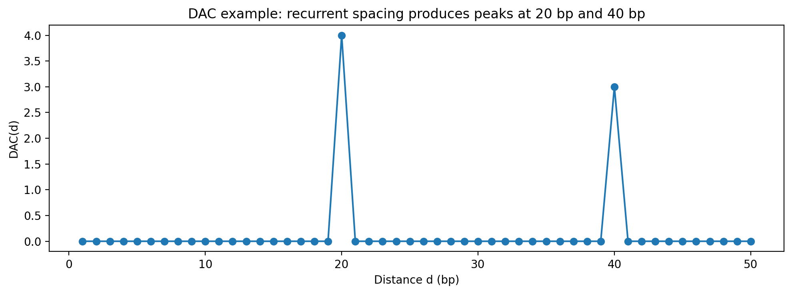

# `dac` example outputs

[Command documentation](../commands/dac.md) · [Back to the README workflow](../../README.md#clickable-workflow-test-dyads--dac--nrl)

`nucleosuite dac` calculates distance autocorrelation from a signal track. Recurrent dyad spacing produces peaks at the corresponding distances and their multiples.

## Example command

```bash
nucleosuite dac \
  --bigwig sample_145_147_dyad.bw \
  --chrom-sizes sample.bam \
  --dmax 2000 \
  --out-prefix sample_145_147_dac
```

## Example DAC plot



A real analysis writes the DAC table and its associated plot. The resulting TSV can be passed directly to [`nrl`](nrl.md).
